Administración
=================

Usuarios
^^^^^^^^^^^^^^^^^^^^^^
Los usuarios del sistema o usuarios cliente son personas que se conectan
al sistema para hacer uso de los servicios que éste les proporciona.
Dentro de los usuarios del sistema podemos distinguir diferentes
perfiles o niveles de usuario, y dependiendo de dicho nivel poseerá más
o menos privilegios en su estancia dentro del sistema Contigo. Es
necesario indicar que rol o función tendrán los usuarios, porque
dependerá de los mismos para la correcta navegación del sistema. Un
usuario consta de 3 datos que permitirán el reconocimiento del mismo
dentro del sistema contable Contigo, los cuales son: Nombre del usuario,
correo electrónico y una contraseña dada por el sistema. **Importante:**
Para generar usuarios dentro del sistema, es recomendable hacerlo dentro
del módulo de Contactos (Para más información revise el manual **Contigo General**).

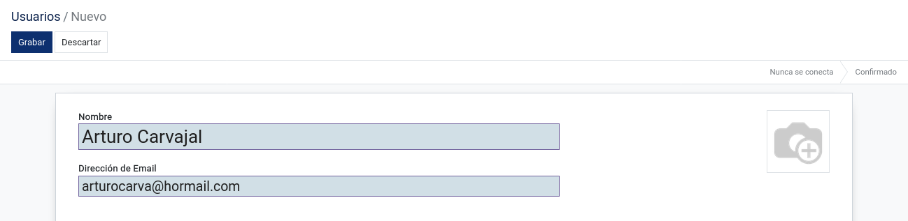

Es importante definir los Permisos de acceso, la tienda (Agencias) en
donde se encuentra laborando y las preferencias de usuario (El mismo
usuario puede configurar sus preferencias dentro del sistema).

**Permisos de acceso:** El usuario debe tener permisos para acceder a los
diferentes módulos que existen dentro del sistema y también para poder
ver o interactuar con la información presente en los mismos. Se pueden
asignar los permisos cuando se cree un usuario y dependiendo de los
permisos asignados para dicho usuario, el sistema le indicará a qué
acciones puede realizar en el mismo, tales como las ventas, la
contabilidad, el inventario, otros, además de las opciones técnicas, los
derechos extras y una última opción de otro que contiene creación de
contacto.

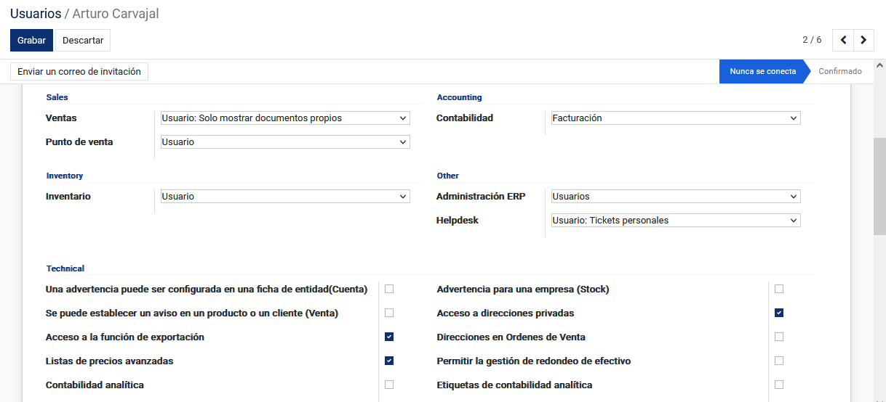

**Tiendas:** Permite identificar las tiendas/agencias en las cuales se
encuentra el usuario y en las tiendas que tiene permitido trabajar.

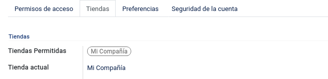

**Preferencias:** Permite una serie de configuraciones dentro del sistema,
como el idioma, la zona horaria, notificación (Manejar por correos
electrónicos o Manejar en Odoo), firma de correo electrónico y por
último una firma digital.

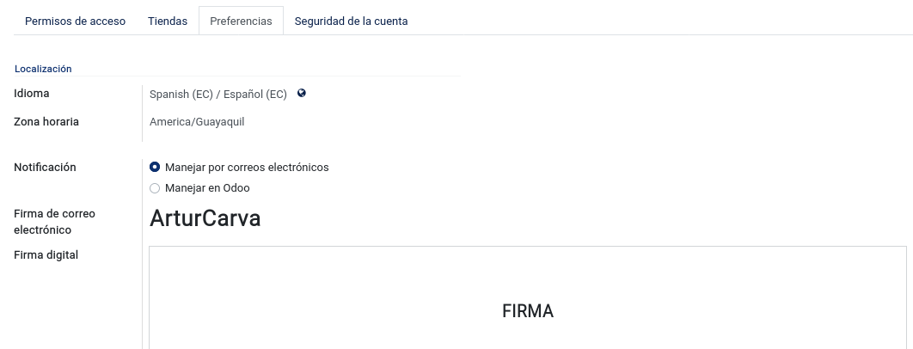

Cuando seleccione firma de firma digital, le va a aparecer una ventana
que dice adopte su firma, si no tiene una firma guardada en la
computadora seleccione “Dibujar”, si ya posee una firma en la
computadora seleccione “Cargar” para subir el archivo que contiene una
firma y si está seguro de su decisión presione “Aprobar y firmar”.

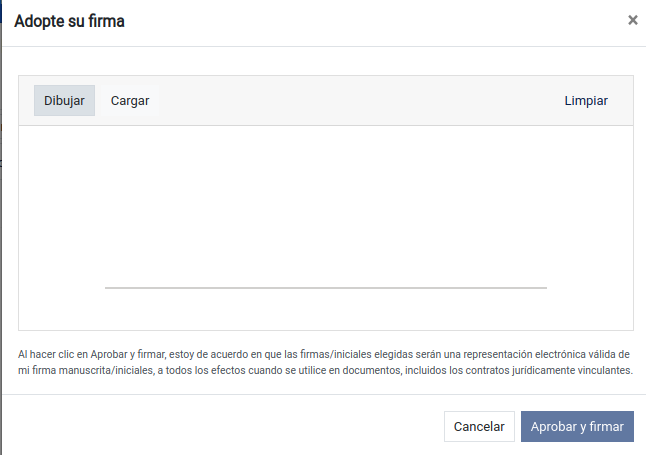

.. note::
Para asignar una contraseña y restablecer la misma, se
requiere seguir los siguientes procesos. 1.- Asignación de contraseña
por medio del administrador: Esta opción permite al administrador del
sistema establecer o asignar la contraseña de usuario. Para que está
acción se ejecute; el usuario debe dirigirse en la parte superior del
sistema e identificar el botón de Acción, presionarlo después de eso
saldrán tres opciones elija la opción que dice “Cambiar la contraseña”.

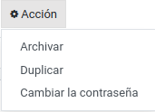

El sistema mostrará un formulario simple, el cual consta del correo del
usuario en la parte izquierda y el espacio para la nueva contraseña en
la parte derecha. Cuando se haya ingresado la nueva contraseña, se
procede a confirmar (Cambiar la contraseña).

.. image:: ../static/images/6/administracion_cambiarlacontraseña.png
    :align: center

.. note::
    Este proceso se recomienda utilizarlo si es necesario que el
    usuario ingrese de manera urgente al sistema, caso contrario se
    recomienda que los usuarios sigan el paso 3.

2. – Enviar instrucciones de restablecimiento de contraseña: Esta opción
   permite enviar al correo del usuario una dirección web que lo
   redirigirá al sistema.

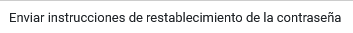

.. image:: ../static/images/6/administracion_cambiarcontraseñas.png
    :align: center

3.- Cambiar contraseña: Si el usuario no posee ninguna contraseña o no
recuerda la misma, es preferible que utilice esta opción. En la página
de inicio de sesión debajo de Iniciar Sesión aparecerá la opción Cambiar
Contraseña de la cual se deben seguir los pasos indicados por el sistema
para la obtención de la nueva contraseña.

.. image:: ../static/images/6/administracion_cambiarcontraseñaa.png
    :align: center

Compañias
^^^^^^^^^^^^^^^^^^^^^^

La opción de “Compañías” permite el ingreso de datos que se mostrará
dentro del sistema, dependiendo de cómo se configure, se habilitan o
deshabilitan opciones que se reflejarán en un manejo diferente en el
sistema. Por defecto hay un registro con el nombre de My Company (Mi
Compañía), es necesario ingresar a dicho registro para poder configurar
con los respectivos datos de la empresa. Se procede a llenar los campos
con su respectiva información según la empresa, especialmente los campos
obligatorios empezando por el nombre de la compañía.

.. image:: ../static/images/6/administracion_compañias.png
    :align: center

.. image:: ../static/images/6/administracion_nombredelacompañia.png
    :align: center

**Información General:** Se debe registrar todos los datos de la compañía y
si la compañía posee factura electrónica, llenar en el sistema sus
respectivos campos para su posterior utilización.

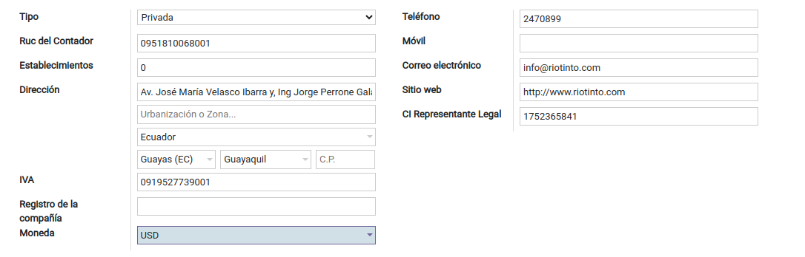

**Contabilidad:** Permite indicar al sistema las retenciones, sustentos
tributarios, las cuentas contables y la cuenta de transferencia entre
bancos que la empresa utiliza para toda su actividad contable.

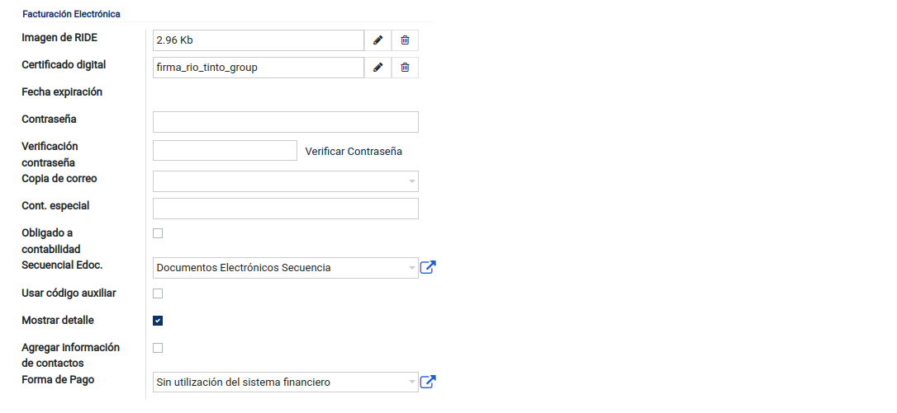

El sistema muestra opciones que afectarán a otros módulos como:
Contabilidad **Verificación de correo:** Si esta opción está marcada,
los contactos dentro del sistema estarán obligados a llenar el campo de
Correo electrónico, esta verificación de correo sirve al momento de
generar un documento electrónico de un contacto seleccionado.

**Agente de retención:** Esta opción determinará si la compañía posee un
agente de retención.

**Obligado a contabilidad (Cont. Especial):** Se deberá llenar si la
compañía está obligada a llevar contabilidad, caso contrario no lo
seleccione.

**Contribuyente Régimen RIMPE (Negocio Popular):** Se deberá llenar si
es un negocio popular, caso contrario no lo seleccione.

**Número de resolución de agente de retención:** Se deberá llenar esta
opción si se posee agente de retención, caso contrario dejar en blanco.

**Obligar identificación contactos:** Si esta opción está marcada, los
contactos dentro del sistema estarán obligados a llenar los campos Tipo
ID y Cedula/Ruc.

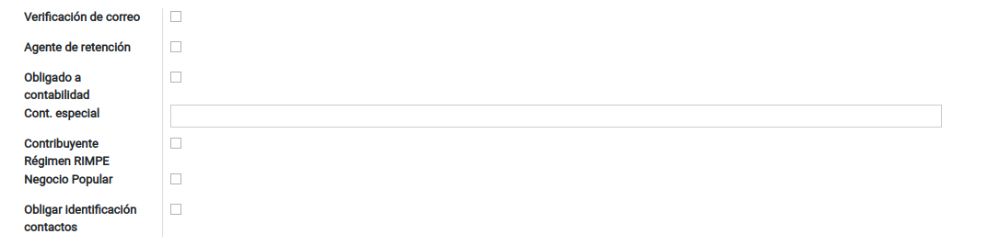

**Retenciones:** Para utilizar correctamente los siguientes apartados, se
requiere ya tener configurado las siguientes retenciones: Ret. IVA
Bienes Ret. Renta Bienes Ret. IVA Servicios Ret. Renta Servicios

.. image:: ../static/images/6/administracion_compañiaretenciones.png
     :align: center

**Cuentas Contables:** Permite enlazar las cuentas de ingreso y gastos a
los elementos del plan contable.

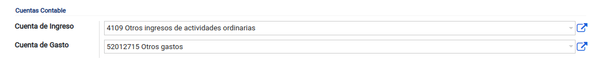

**Anticipos:** Permite configurar las cuentas de anticipos para clientes y
proveedores.

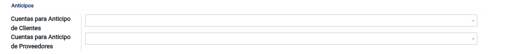

**Conciliaciones Bancarias:** Permite la configuración de dos cuentas, las
cuales sirven para realizar los pagos no registrados o no identificados
en el sistema y así obtener cuadre de la conciliación.

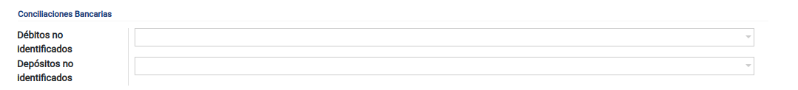

**Firmas Asientos Contable:** Al momento de guardar un asiento,
dependiendo de los usuarios seleccionados en esta opción; el mismo
aparecerá en el registro y posteriores.

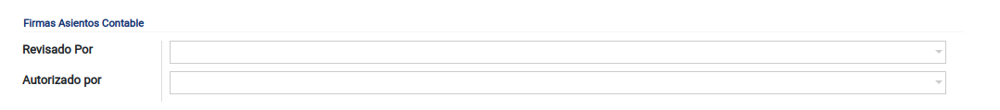

**Bancos:** Se tiene que poner el número de la cuenta de transferencias
interbancarias.

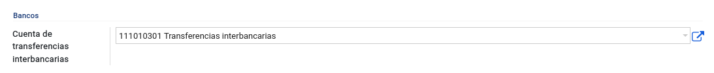

Agencias
^^^^^^^^^^^^^^^^^^^^^^

Establecimiento comercial creado por una empresa o una sociedad, que
goza de cierta autonomía con relación a la empresa o sociedad creadora,
sin ser jurídicamente distinta de ella. En esta opción se procede con la
creación de las diferentes agencias o sucursales que se desee manejar en
el sistema. Se puede tener sucursales principales o padres y
secundarias.

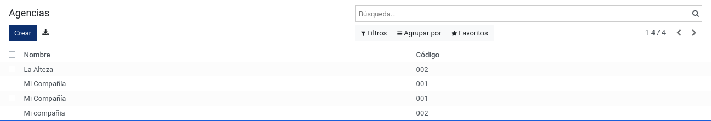

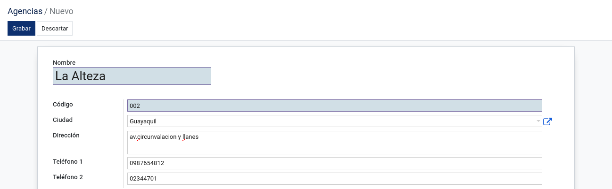

En el campo **Sucursal Padre** se selecciona el nombre de una sucursal
previamente creada, esto nos permite diferenciar cual es la sucursal
principal y cuáles son las secundarias, dependientes de la principal.

Servidores Correo Saliente
^^^^^^^^^^^^^^^^^^^^^^

Un servidor de correo saliente es un servidor que se ocupa de enviar
correos desde su buzón de correo. Para crear el servidor de correo
saliente, se añade una descripción de nuestro correo y seleccionamos su
prioridad (entre más bajo el número mayor será la prioridad); en la
información de la conexión colocamos: Servidor SMTP = smtp.dominio.com
Puerto SMTP = 465 Por último, se selecciona en seguridad de la conexión
SSL/TLS y posteriormente se configura el usuario y la contraseña del
correo, se prueba la conexión y listo.

.. image:: ../static/images/6/administracion_servidorescorreosalientes.png
     :align: center

.. image:: ../static/images/6/adminsitracion_servidorcontigo.png
     :align: center

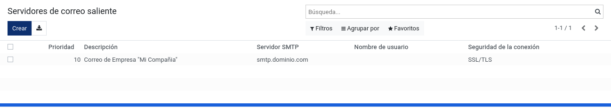

Secuencia
^^^^^^^^^^^^^^^^^^^^^^

Aquí es donde se encuentran los códigos de secuencia creados por el
propio usuario, con un código de secuencia, nombre, el prefijo, tamaño
de frecuencia, próximo número, pasó y por último la implementación.

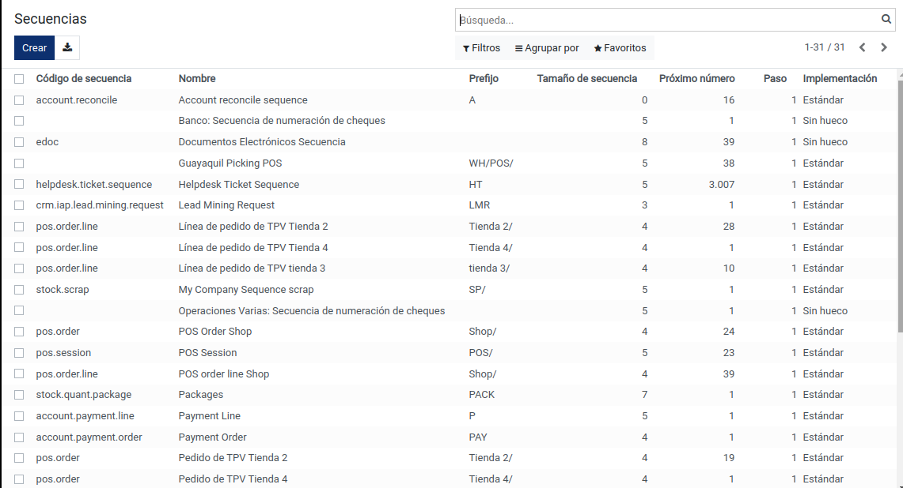

Estas son creadas por el nombre, el código de secuencia, la
implementación (para saber si es Estandar o es sin hueco) y ver si está
activo caso contrario no se va a seleccionar el activo.

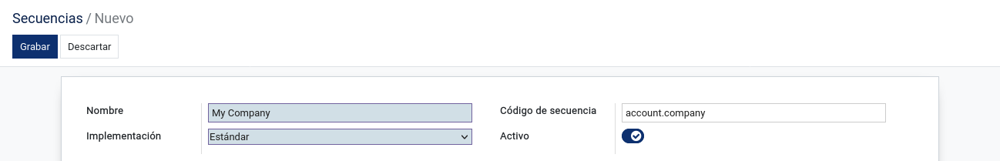

**Secuencia:** En secuencia se tienen que llenar unos datos más:
Prefijo: Cual será el valor del prefijo para la secuencia Sufijo: Su
valor de sufijo Utilizar subsecuencias por date-range: Si va a desear
utilizar subsecuencias por date-range selecciónelo le va a aparecer una
tabla para agregar desde una fecha hasta que fecha, caso contrario no
seleccione la opción. Tamaño de secuencia: Cuando 0 se van agregar a la
izquierda del número Paso: El número siguiente de la secuencia será
incrementado por esté número. Próximo número: Es el próximo número que
se utilizará, este número puede incrementarse frecuentemente por lo que
el valor mostrado puede ya estar obsoleto

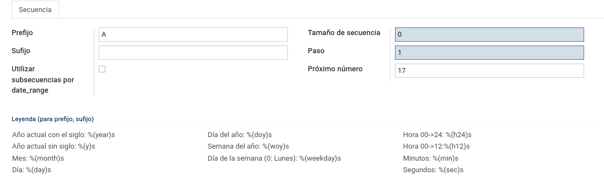

Precisión decimal
^^^^^^^^^^^^^^^^^^^^^^

La precisión decimal permite indicar al sistema cuál será la referencia
de los diferentes datos numéricos y los decimales de los mismos. Por
ejemplo: El sistema muestra una precisión decimal llamada Precio
Producto el cual solo será utilizada al momento de registrar el precio
de un producto, si el digito ingresado como precio es de ‘5.789’ el
sistema lo mostrará como ‘5.79’ ya que aplica redondeo y el número de
dígitos decimales son dos.

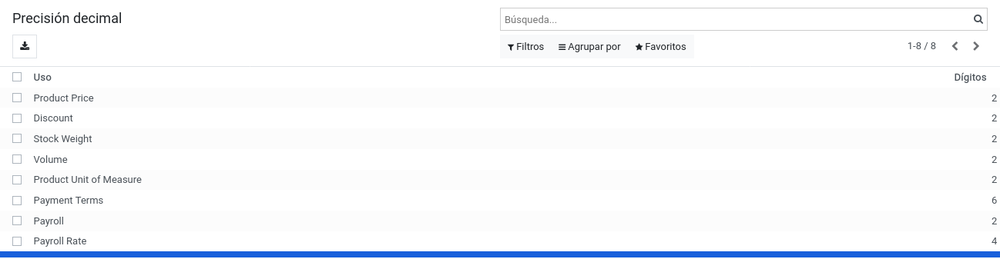

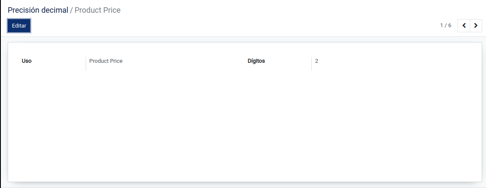

Correo Electrónico
^^^^^^^^^^^^^^^^^^^^^^

En el correo electrónico se van a mostrar los mensajes que han sido
enviados por el usuario o el sistema, estos están conformados por la
fecha, asunto, y el usuario.

Cuando presione en un mensaje va a ser llevado a la página del mensaje
mostrando el contenido del asunto, por quien está hecho, desde donde es,
hasta donde va a ser enviado, a qué empresa va a ser llevado, el
destinatario en copia carbón, si llega “responder a” en caso de existir
un inconveniente con el mensaje, fecha planeada de envío para saber
cuando fue enviado o debió haber sido enviado.

Si se presiona en editar, se podrá editar el contenido del mensaje y las
opciones ya dichas

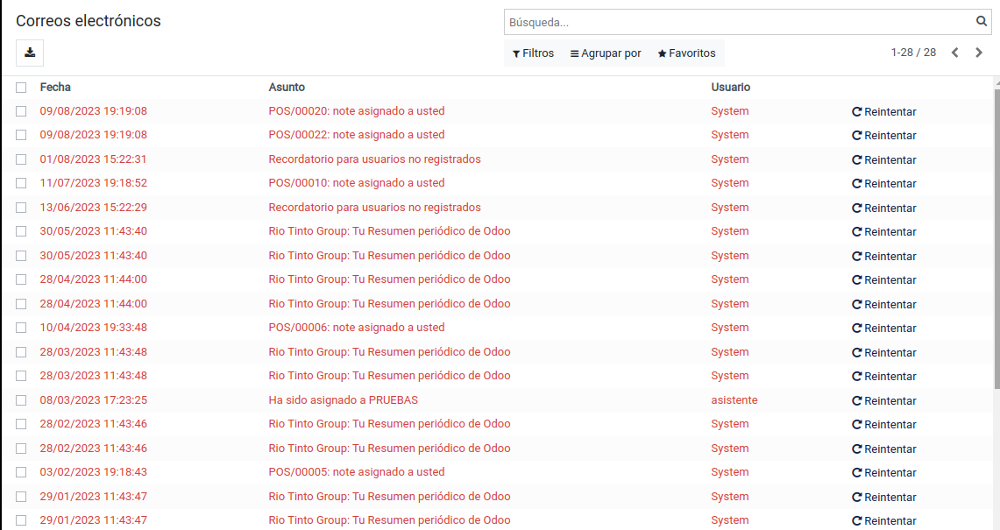

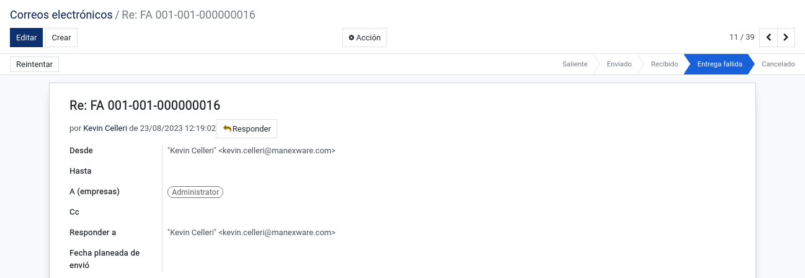

**Contenido:** Aquí se muestra que contiene el mensaje

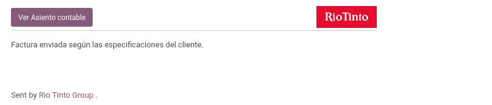

**Adjuntos:** Se asocian un documento mediante el modelo/res_id y al mensaje
mediante este campo.

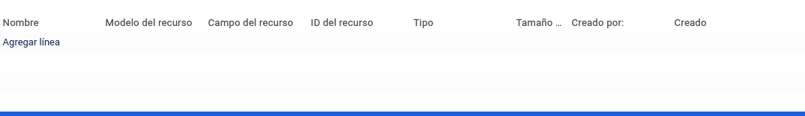

**Razón del fallo:** Aquí se muestra la razón del fallo de la entrega de
correo del porque no fue enviado

