6. Contabilidad
===============

.. image:: ../static/images/6/modulocontabilidad.png

Clientes
---------
Facturas/Clientes
-----------------
Seleccionar el módulo de **Contabilidad**, dirigirse al menú de **Clientes** y buscar
la opción **Facturas.**

Una factura es un documento de carácter mercantil que indica una
compraventa de un bien o servicio y que, entre otras cosas, debe incluir
toda la información de la operación. Al momento de seleccionar la
pestaña, el sistema permitirá crear facturas, eliminarlas, etc.

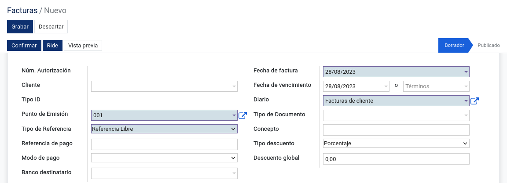

Se procede a llenar los campos obligatorios (campos de color
azul), se selecciona al cliente, se llena la fecha de la factura; en el
caso de la fecha de vencimiento, se puede establecer utilizando una
fecha específica o un término; luego se selecciona el tipo de descuento
(Porcentaje o Cantidad), en el caso que se quiera realizar un descuento
a todos los productos de la factura, se procede a llenar el campo de
descuento global y se aplicará dicho descuento a los productos
ingresados.

.. image:: ../static/images/6/detallefactura.png

Las líneas de factura, sirven para agregar los
productos a la factura, para agregar un producto dar clic en **Agregar
línea**, automáticamente se puede seleccionar un producto que esté en el
sistema y al momento de añadirlo en la línea se cargarán por defecto los
datos del producto como la descripción, el tipo de cuenta (se puede
seleccionar otro tipo si se desea), el impuesto que por defecto es IVA
12% o código 401, el precio dependerá del producto (para más información
revisar **Productos**), en el caso que un producto tenga un descuento
específico, se lo puede añadir en la línea, indica la cantidad de dicho
producto y el subtotal dependerá del resultado de: cantidad \* precio
del producto - descuento + impuestos.

Al momento de completar las líneas de factura, el sistema le mostrará
los cálculos realizados para la obtención del total a cobrar.

Por defecto la forma de pago se genera automáticamente como “Sin
utilización del sistema financiero”, si desea especificar otra forma de
pago, deberá escoger manualmente.

.. image:: ../static/images/6/formadepago.png

Si se desea ingresar algún tipo de dato adicional, se lo podrá realizar
en la parte de “Información Adicional”, para agregar un dato adicional
dar clic en agregar línea y llenar el campo nombre y el campo
descripción.

.. image:: ../static/images/6/infoadicional.png

La factura se rige por los siguientes estados: **Borrador** y
**Publicado**

Para cambiar el estado de la factura, se debe hacer lo siguiente: Se
debe dirigir a la esquina superior izquierda, donde se encontrará con
los siguientes botones.

.. image:: ../static/images/6/botonesfacturas.png

**Confirmar:** Permite cambiar el estado a Publicado, al momento de que la factura esté en este estado no
se podrá realizar ediciones en las líneas de factura y mostrará una
serie de opciones que serán detalladas a continuación:

.. image:: ../static/images/6/facturapublicada.png

**Generar Edoc:** Al momento de dar clic en esta opción se generará el
documento electrónico de la factura. (imagenporinsertar)

**Ride:** Al dar click aparecerá el documento factura completa.

... image:: ../static/images/6/generaride.png

**Enviar e imprimir:** Esta opción visualizará el documento ya procesado
dentro del sistema para enviar e imprimir.

**Vista Previa:** Este botón muestra en pantalla cómo se verá la
factura, podremos descargar dicha previsualización en formato PDF o
enviarla a imprimir. Para poder previsualizar la factura se deberá tener
llenos los siguientes campos: Fecha de la factura, RUC del cliente,
secuencia interna de la factura, tipo de comprobante y la forma de pago.

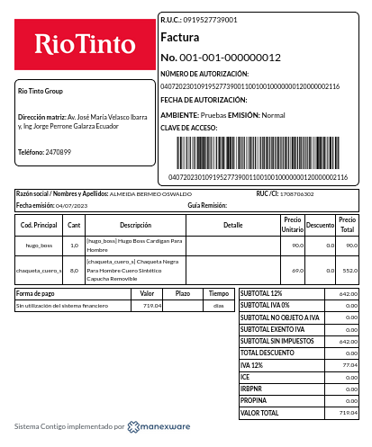

**Añadir nota de crédito:** Esta opción le permite crear créditos de
forma rápida y sencilla. Se recomienda utilizar este método al ingresar
facturas al sistema, ya que optimiza el tiempo dentro del proceso de
creación de notas de crédito. El proceso es fácil. Seleccione el método
de crédito y la fecha de cancelación.

.. image:: ../static/images/6/añadirnotadecredito.png

**Crear nota de débito:** Esta opción le permite crear deditos de forma
rápida y sencilla. Se recomienda utilizar este método al ingresar en el
sistema, ya que optimiza el tiempo dentro del proceso de creación de
notas de débito. El proceso es fácil. Seleccione el método de débito y
la fecha de la nota de débito.

.. image:: ../static/images/6/crearnotadedebito.png

**Agregar Retención:** Para añadir una retención a la factura, se debe
dar clic en esta opción, se llenan los campos obligatorios como el
número de documento, la fecha, periodo fiscal, el número de
autorización, el diario, cliente y el detalle de la retención.

.. image:: ../static/images/6/agregarretencion.png

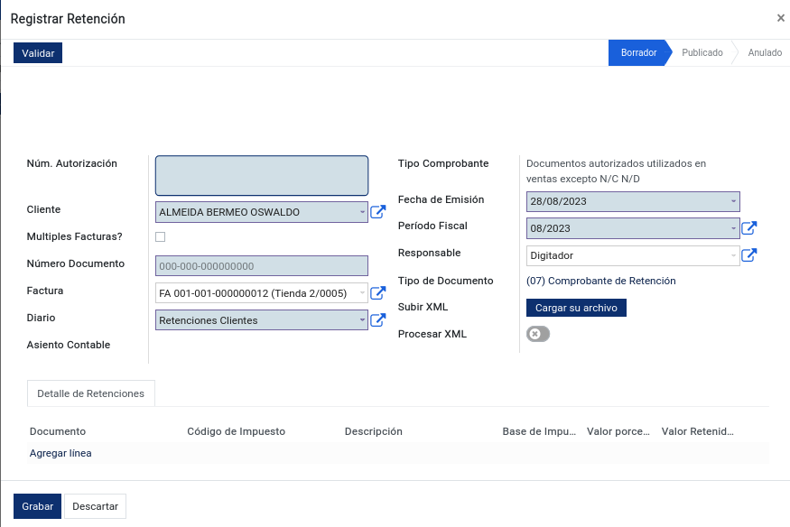

Al momento de guardar la retención, se generará un pago
pendiente el cual mostrará en los valores totales de la factura un ítem
llamado “créditos pendientes”, dicho ítem nos mostrará todos los valores
de pago pendientes y se dará la opción de añadir dicho pago al monto
total de la factura; en el caso de que se le añada el pago, el monto
total de la factura se sumará con el valor pendiente dando como
resultado un monto total diferente.

.. image:: ../static/images/6/montototalfactura.png

**Anular Facturas:** Permite la anulación de la factura enviando la
misma a un estado adicional llamado Anulado, dicho estado sólo aparecerá
si se anuló la factura.

.. image:: ../static/images/6/anularfacturas.png

.. image:: ../static/images/6/vistaanulado.png

Cuando la factura está en este estado, solo mostrará los siguientes
botones: “Generar Edoc”, “Ride”, “ Vista Previa” y “Restablecer a
Borrador”.
Si se desea reactivar dicha factura se debe hacer clic en “Restablecer a
borrador”, en ese momento el sistema cambiará de estado anulado a
borrador, es el mismo estado que tienen las facturas al momento de
recién creadas; luego se procederá a modificar los datos existentes y
después se valida cuando esté completada.

.. image:: ../static/images/6/vistaanulado.png

Se añadirá a nuestras facturas creadas los términos y condiciones en la
sección final del documento, solo se podrá editar dicho término si la
factura se encuentra en estado de borrador.

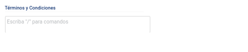

**Compartir:** Esta acción se permitirá enviar el documento a uno o más
de los destinatarios designados, dichos destinatarios deben tener
definido el correo en su perfil de contacto.Compartir: Esta acción se
permitirá enviar el documento a uno o más de los destinatarios
designados, dichos destinatarios deben tener definido el correo en su
perfil de contacto.

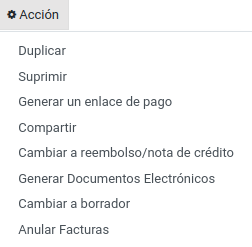

Notas de Credito
----------------------

En el módulo de Contabilidad, seleccionar el menú Clientes y luego la
opción Notas de Crédito. Una nota de crédito es un documento legal que
se utiliza en transacciones de compraventa donde interviene un descuento
posterior a la emisión de la factura, una anulación total, un cobro de
un gasto incurrido de más o la devolución de bienes. Para la correcta
creación de una nota de crédito, es recomendable realizarla a través de
la factura (para más información revisar “Factura Clientes”). El sistema
permitirá la edición del documento, al momento de editarlo es necesario
llenar los campos obligatorios que existen en el mismo, la vista que
proyectará el sistema es casi idéntica a la factura con la diferencia
que se debe especificar el número de documento tributario para poder
generar la nota; también es idéntica a la de nota de débito. La nota de
crédito podremos validarla, previsualizarla, cancelarla, registrar
pagos, etc.

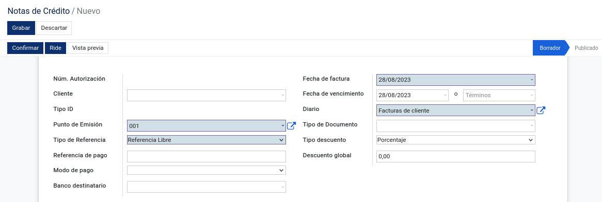

.. image:: ../static/images/6/notadecreditocreada.png

.. image:: ../static/images/6/detallenotadecredito.png

Se sabe que es una nota de crédito porque en la pestaña “Otra
Información” existe el “Tipo de comprobante” que indica “Nota de
Crédito”.

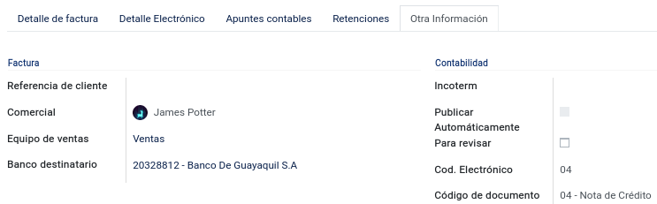

Entre otras se encontrara lo que es el botón de **“imprimir”:**

**Facturas:** La factura es un documento que indicará una compraventa de
un producto que se ha registrado en la compra.

.. image:: ../static/images/6/facturanotadecredito.png

Se presenta un boton de **acciones**:

.. image:: ../static/images/6/accionesnotadecredito.png

**Duplicar:** Duplica la información de la nota de crédito ya creada en
el sistema.

**Suprimir:** Se eliminará el documento dentro de la nota de crédito.

**Generar un enlace de pago:** Los enlaces de pago no son más que una
url que podemos enviar al cliente a través de cualquier medio y al
clicar en él, el consumidor accede directamente a la página final de
pago de nuestro producto o servicio.

.. image:: ../static/images/6/enlacedepago.png

**Compartir:** Consiste en un enlace o URL único o abierto, que se
genera para cada compra y que puedes compartir con tu cliente a través
de diferentes canales como correo electrónico, mensajes de texto, entre
otros.

.. image:: ../static/images/6/compartirnotadecredito.png

**Cambiar a reembolso/nota de crédito:**

Facturas de Reembolso de Gastos
-------------------------------------

En el módulo de **Contabilidad**, seleccionar el menú **Clientes** y
luego la opción **Facturas de Reembolso de Gastos.**

Las facturas de reembolso de gastos son deducibles del Impuesto a la
Renta y, el IVA pagado, constituye crédito tributario.

Para solicitar el reembolso, el intermediario deberá emitir una factura
con el concepto de reembolso de gastos, en la cual se detallarán los
comprobantes de venta con el motivo del reembolso.

Además, quien solicita el reembolso debe adjuntar los originales de los
comprobantes por los que se pide el reembolso. Los comprobantes de venta
deben estar a nombre del intermediario. Esta factura por reembolso no
está sujeta a retenciones en la fuente de Impuesto a la Renta ni de IVA.

En el caso de que el intermediario del reembolso sea un empleado en
relación de dependencia con la empresa, éste podrá emitir una
liquidación de compra de bienes y prestación de servicios en sustitución
de la factura por el reembolso.

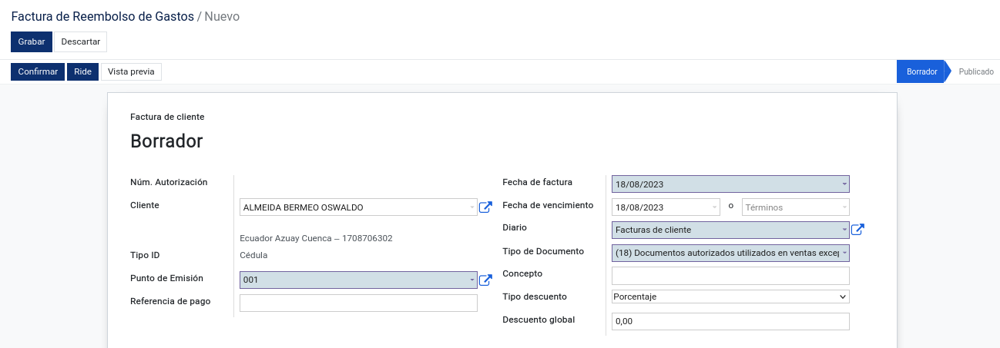

.. image:: ../static/images/6/formadepagoreembolsos.png

Notas de Débito
---------------------

En el módulo de **Contabilidad**, seleccionar en el menú **Clientes** la
opción **Notas de Débito.**

La nota de débito es un documento que se le enviará al comprador o
cliente para avisarle que ha aumentado la cantidad de su deuda por algún
motivo. Con este documento se le avisará que se le ha cargado, o que
debe una cantidad de dinero por el concepto que se especifica en la
nota. Al contrario que la nota de crédito es la notificación a un
comprador de que se le debe cobrar más dinero.

El sistema permitirá la edición del documento; al momento de editarlo es
necesario llenar los campos obligatorios que existen en el mismo, la
vista que proyectará el sistema es casi idéntica a la factura con la
diferencia que se debe especificar el número de documento tributario que
se generará en la nota; también es idéntica a la de nota de crédito. La
nota de débito se podrá validar, previsualizar, cancelarla, registrar
pagos, etc.

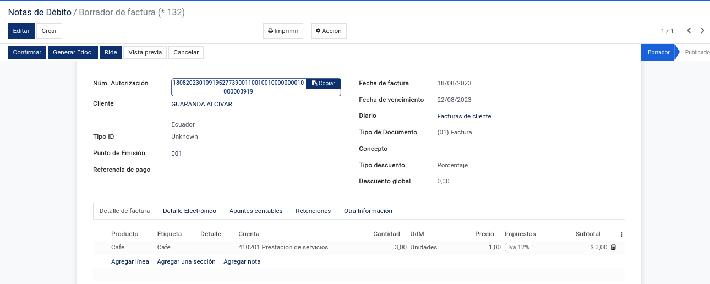

Sabemos que es una nota de crédito porque en la pestaña “Otra
Información” existe el “Tipo de comprobante” que indica “Nota de
Débito”.

.. image:: ../static/images/6/otrainfonotadedebito.png

Retenciones Ventas
------------------------

En el módulo de **Contabilidad**, seleccionar el menú **Clientes** y la
opción **Retención Ventas.**

La retención es la cantidad que se retiene de un sueldo, salario u otra
percepción para el pago de un impuesto, de deudas en virtud de embargo,
es decir, te retienen ahora para asegurar el pago del impuesto. Para la
correcta creación de una retención ventas, es recomendable realizarla a
través de la factura (para más información revisar Factura Clientes).

Al momento de editar una retención de venta, se deben llenar los campos
obligatorios, el número de la retención, la empresa, el documento de
origen, el número de autorización, la fecha de vencimiento de dicha
autorización, el diario, el comprobante, la fecha de emisión y el
responsable de dicha retención.

**Detalle de retención:** Llenar el año fiscal y el impuesto ya sea IVA
o RENTA; la base del impuesto se llenará de manera automática, el valor
porcentual y el valor retenido.

**Información Extra:** Seleccionar el tipo de comprobante. En la esquina
superior izquierda, debajo de la opción Guardar nos aparecerá una barra
para poder Validar .

.. image:: ../static/images/6/detalleretencionventas.png

Detalle de Retención en Ventas
------------------------------------

En el módulo de **Contabilidad**, seleccionar en el menú la opción
**Detalle de Retención Ventas.** Como su propio nombre lo indica,
muestra todas las retenciones en ventas de los clientes a una vista
sencilla.

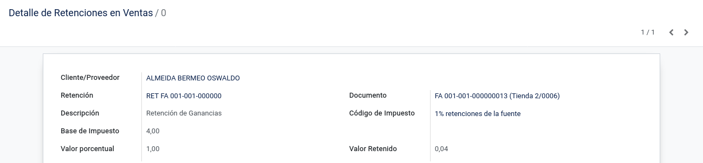

Pagos
-----------

En el módulo de **Contabilidad**, seleccionar el menú **Clientes** y
luego la opción **Pagos.**

Un pago es lo que una persona o entidad realiza para poder cancelar o
suprimir una obligación que se tenía contraída. El pago puede efectuarse
mediante la entrega de un bien, servicio o activo financiero a cambio de
otro bien, servicio o activo financiero.

Se recomienda realizar los pagos a través de las opciones que se dará
las facturas, notas de crédito y notas de débito dentro del sistema de
contigo.

**Seleccionar el tipo de pago:** “Enviar dinero”, “Recibir dinero” o
“Transferencia interna”; llenar la fecha de pago, la circular de este,
la fecha del depósito, el tipo de empresa (que por defecto está en
seleccionado cliente), la empresa y la cantidad. Por último, el sistema
permite ingresar las líneas de contrapartida.

También el sistema permitirá imprimir el recibo de pago, el comprobante
de pago y el cheque este último siempre y cuando el pago sea en cheques.

.. image:: ../static/images/6/editarpagos.png

.. image:: ../static/images/6/vistapagos.png

En el momento de seleccionar al cliente, si existen
pagos pendientes el sistema de manera automática nos mostrará el número
de pagos pendientes y la cantidad de estos.

.. image:: ../static/images/6/movpendientrescruce.png

En el caso de que se desee cancelar el asiento para volver a realizarlo,
es necesario configurar el diario para que permita la cancelación de
pagos (para más información dirigirse a Diarios).

.. image:: ../static/images/6/cancelarasientoerror.png

Al momento de realizar un pago en cheque es necesario primero configurar
la chequera en el sistema (para más información revisar **Chequeras** ),
la opción de cheques sólo aparecerá si el pago es **enviar dinero** o
una **transferencia interna** y se selecciona la opción de cheques.

Se procederá a llenar el punto de emisión correspondiente, la ciudad y
la fecha del depósito, si se deja la fecha de depósito en blanco el
sistema utilizará la fecha de pago como fecha de depósito.

.. image:: ../static/images/6/pagosborrador.png

Imprimir: El sistema nos permitirá realizar los siguientes reportes
,“recibo de pago”, “cheque”.

.. image:: ../static/images/6/btnimprimirnd.png

.. image:: ../static/images/6/opcimprimirpagos.png

.. image:: ../static/images/6/recibopagopdf.png

**Acciones:** La opción de pagos cuenta con las opciones duplicar,
suprimir y enviar recibo por correo electrónico.

.. image:: ../static/images/6/accionespago.png

En la parte superior encontraremos dos botones:

**Factura:**

.. image:: ../static/images/6/facturaenpagos.png

.. image:: ../static/images/6/detallefacturaenpagos.png

**Asiento contables:**

.. image:: ../static/images/6/asientoscontablespagos.png

**Nota:** En el caso de que se necesite crear un pago con múltiples
facturas, primero se debe visualizar que las facturas estén en estado
Abierto.

Se seleccionan las facturas del mismo cliente, por consiguiente, se debe
dirigir en la opción Acción y seleccionar Registrar Pago.

Después de dar clic en la opción Registrar Pago, se debe llenar el
formulario seleccionando la cantidad, el diario de pago, la fecha del
pago y seleccionar en la opción grupo de facturas; al finalizar dar clic
en el botón Validar.

.. image:: ../static/images/6/registrarpago.png

Para terminar de registrar el pago, se debe editar el nuevo formulario
que el sistema mostrar, que es el mismo formulario de pagos, pero con la
diferencia que es un pago de múltiples facturas.

.. image:: ../static/images/6/llenarfacturaenpagos.png

.. image:: ../static/images/6/facturaapartirdepagos.png

Vehìculo
--------------

Estos campos son útiles para llevar un registro organizado de los
vehículos y sus propietarios, así como para proporcionar una forma de
identificar y comunicarse con las personas asociadas con los vehículos
en caso de necesidad.

.. image:: ../static/images/6/vehiculos.png

Guías de Remisión
-----------------------

En el módulo de Contabilidad, seleccionar en el menú Clientes la opción
Guías de Remisión.

Este documento sirve para sustentar el traslado de mercaderías dentro de
la nación. De esta forma habrá constancia de que es un traslado legal.
La función de este documento es identificar actividades que se puedan
estar realizando fuera del marco legal y además tener un control
tributario, que garantice que no se evadan los tributos.

Al momento de generar una nueva guía se debe:

::

   • Configurar primero el punto de emisión (ver Punto de Emisión), seleccionar el transportista (ver Contactos), el destinatario (ver Contactos) y la factura (ver Factura en el menú de Clientes).
   • Se llenarán todos los campos obligatorios y los que se considere necesario llenar.
   • Al momento de seleccionar el destinatario automáticamente se cargarán los datos de este en las siguientes columnas: Identificación, teléfono, cédula y correo.
   • Al momento de seleccionar la factura, automáticamente se cargarán en ítems de guía, los datos de la factura de igual manera en Detalle electrónico.

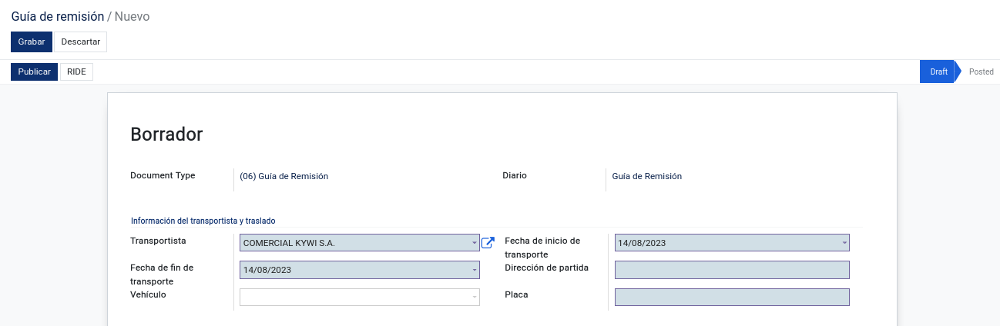

.. image:: ../static/images/6/infodestinatarioguiaremision.png

.. image:: ../static/images/6/detalleelectronicoguiaremision.png

Productos
----------------

En el módulo de **Contabilidad**, seleccionar en el menú **Clientes** la
opción **Productos.**

Un producto es una opción elegible, viable y repetible que la oferta
pone a disposición de la demanda, para satisfacer una necesidad o
atender un deseo a través de su uso o consumo. La diferencia entre un
producto cliente y un proveedor es que el producto cliente puede ser
vendido.

| Se podrá añadir una imagen o foto que identifica el producto, el
  nombre del producto y si el producto puede ser vendido o puede ser
  comprado.

|

.. image:: ../static/images/6/ejemploproducto.png

En la esquina superior derecha podremos observar tres recuadros: Precio
extra, Entrada y Salida, y Unidades vendidos la primera nos permite ver
todos los movimientos que ha tenido dicho producto en la empresa,
mientras que la segunda nos permite archivar y desarchivar el producto;
en el caso de que se archive este producto no aparecerá en las compras o
ventas hasta que se desarchive.

.. image:: ../static/images/6/botonesproductos.png

**Información General:** Se permitirá ingresar detalles específicos del
producto y también dejará notas para una mejor referencia como el tipo
de producto, referencia interna, código de barras, categoría del
producto (si se desea añadir una nueva categoría, el sistema le
permitirá crearla desde el ítem de selección), el precio de venta,
precio al por mayor, el impuesto a cliente y el costo; también se podrá
añadir una nota interna.

.. image:: ../static/images/6/infogeneralproductos.png

**Compra:** Esta opción sólo aparecerá si está marcado ‘Puede ser
Comprado’ y especificará el número de impuesto del proveedor para
futuras facturas.

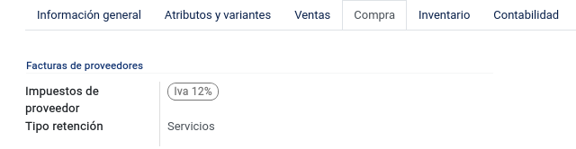

**Inventario:** Permitirá ingresar cómo será
la operación y logística de dicho producto, agregar descripción para
pedidos de entrega y recepciones.

.. image:: ../static/images/6/inventarioproductos.png

**Contabilidad:** Permite
seleccionar la cuenta de ingreso (A cobrar) y la cuenta de gastos (A
pagar) de dicho producto.

.. image:: ../static/images/6/contabilidadproductos.png

También el sistema permitirá imprimir en este caso la etiqueta del
producto y el código de barra del producto.

.. image:: ../static/images/6/imprimiretiquetas.png

Clientes
---------------

En el módulo de **Contabilidad**, seleccionar en el menú de **Clientes**
la opción **Clientes.**

Automáticamente se abrirá la vista de Clientes que es igual a la vista
de Contactos (para más información dirigirse a Contactos), por defecto
se añadirá un filtro con el nombre de ‘Clientes’. Dicho contacto
aparecerá en la opción de cliente si y sólo si está marcada la opción en
Ventas y Compras el ítem de ‘Es Cliente’.

.. image:: ../static/images/6/contabilidadclientes.png

Proveedores
---------------

.. image:: ../static/images/6/modulocontabilidad.png

Facturas/Proveedores
~~~~~~~~~~~~~~~~~~~~~~~~~~

En el módulo de **Contabilidad**, seleccionar en el menú de
**Proveedores** la opción **Facturas.**

Una factura es un documento de carácter mercantil que indicará una
compraventa de un bien o servicio y que, entre otras cosas, debe incluir
toda la información de la operación. Al momento de seleccionar la
pestaña, se permitirá crear facturas, eliminarlas, etc.

.. image:: ../static/images/6/facturaproveedor.png

Se procedera a llenar los campos obligatorios (campos de color azul), es
importante añadir el número de la factura, el número de la autorización,
la fecha de vencimiento de la autorización, el tipo de comprobante que
por defecto es “Factura”, seleccionar el diario correspondiente, el
proveedor, la fecha de la factura; en el caso de la fecha de vencimiento
esta se colocará automáticamente dependiendo del plazo de pago (en este
caso el plazo es de 2 meses, por lo tanto, del 1 de julio se le suman
esos 2 meses dando como resultado final 30 de agosto); el punto de
emisión que se encuentra en la vista corresponde solamente a las
retenciones que se realizarán en las facturas agregadas y el digito
cambiará según la secuencia establecida.

.. image:: ../static/images/6/detallefactproveedor.png

Las líneas de factura, sirven para agregar los productos a la factura, para agregar un
producto dar clic en “Agregar línea”, automáticamente puedes seleccionar
un producto que esté en el sistema y al momento de añadirlo en la línea
se cargarán por defecto los datos del producto como la descripción del
mismo, el tipo de cuenta (se puede seleccionar otro tipo si se desea),
el impuesto (que por defecto es IVA 12% o código 500 si el producto
cuenta con retención); es necesario añadir la línea según el número de
retención aplicado en dicho producto, en este caso el código de la
retención es 303, el precio dependerá del producto (para más información
revisar **Productos**), si en el caso de que un producto tenga un
descuento específico se lo puede añadir en la línea, indicas la cantidad
de dicho producto y el subtotal dependerá de la suma de : cantidad +
precio del producto + descuento + impuestos.

.. image:: ../static/images/6/montototalproveedor.png

En el caso de que la factura exceda los mil dólares, el sistema le
notificará que se debe crear una forma de pago para dicha factura, esta
se encuentra la parte inferior, para ingresar una forma de pago se debe
hacer clic en agregar línea, se selecciona la forma de dicho pago para
esa factura, el total, los plazos y la unidad de tiempo.

La factura se rige por los siguientes estados: “Borrador”, “Publicado”.

.. image:: ../static/images/6/estadofactproveedor.png

Para cambiar el estado de la factura, se deberá hacer lo siguiente: se
dirige a la esquina superior izquierda, donde nos encontraremos con los
siguientes botones.

.. image:: ../static/images/6/botonestadosproveedor.png

**Confirmar:** Antes de validar la factura del proveedor es necesario
hacer clic en esta opción, ya que nos ayuda a guardar el cálculo de los
impuestos y añade las líneas correspondientes en retenciones.

**Cancelar:** Permitirá suspender el proceso de guardar el registro del
documento.

.. image:: ../static/images/6/cancelarfactproveedor.png

**Imprimir:** Esta opción nos permite realizar el reporte de
la factura realizada.

.. image:: ../static/images/6/imprimirfactproveedor.png

.. image:: ../static/images/6/factproveedorpdf.png

**Comprobante:** Imprime un archivo PDF que muestra los datos de los
asientos contables.

(fotopendiente)

**Registrar pago:** Esta opción permitirá realizar el pago de dicha
factura, al momento de hacer clic en el botón “Registrar pago” se abrirá
una ventana emergente, para completar el pago se deberá llenar los
siguientes campos: la cantidad a pagar que debe ser igual al monto total
de la factura, la fecha de pago, la fecha del depósito, el circular, el
diario de pago que se derivará a tres opciones (Banco, Efectivo y
Retenciones Clientes) y la cuenta contable, aunque este campo sólo
aparecerá si el diario de pago es banco o efectivo. Pero en el caso de
que el diario de pago sea bancos o retenciones clientes, aparecerá en la
vista el tipo de método de pago del cual se podrá seleccionar de manera
manual o cheque.

.. image:: ../static/images/6/registrarpagoproveedor.png

Al momento de registrar el pago tenemos lo que es el campo de cuenta
contable de pago que se dará ayuda indicando a qué cuenta contable se
está dirigiendo la factura, pero en el caso de que el pago de la factura
se derive a diferentes cuentas contables, se tendrá en la parte de abajo
el ítem de líneas de contrapartida, que permitirá agregar dichas cuentas
contables al pago de la factura.

En el caso de que el pago en las líneas de contrapartida no sea igual al
valor total del pago facturado, la diferencia del mismo pago será tomada
por la cuenta contable de pago que se encuentra en la parte superior.

Al momento de guardar la retención, se generará un pago pendiente el
cual mostrará en los valores totales de la factura un ítem llamado
créditos pendientes, dicho ítem que se mostrará todos los valores de
pago pendientes y nos dará la opción de añadir dicho pago al monto total
de la factura, en el caso de que se le añada el pago, el monto total de
la factura se sumará con el valor pendiente dando como resultado un
monto total diferente.

.. image:: ../static/images/6/montototalapagarproveedor.png

**Agregar nota de crédito:** Esta opción permite la creación de notas de
crédito de manera rápida y sencilla, si la factura está ingresada al
sistema es recomendable utilizar este método, ya que permite la
optimización del tiempo dentro del proceso de creación de notas de
crédito. El proceso es simple: se selecciona el método de crédito (en
este caso es el número de la factura) y la fecha de la nota de crédito.

.. image:: ../static/images/6/agregarnotadecreditoproveedor.png

.. image:: ../static/images/6/crearnotadedebitoproveedor.png

**Cancelar:** Permite la cancelación de la factura enviando la misma en
un estado adicional llamado cancelado, dicho estado sólo aparecerá si se
canceló la factura.

.. image:: ../static/images/6/estadocancelarproveedor.png

| Cuando la factura está en este estado, solo mostrará los siguientes
  botones: “Documento Electrónico”, “ Previsualizar” y “Cambiar a
  Borrador”.
| Si se desea reactivar dicha factura se debe hacer clic en “Cambiar a
  borrador”, en ese momento el sistema cambiará de estado cancelado a
  borrador, es el mismo estado que tienen las facturas al momento de
  recién creadas; luego se procede a modificar los datos existentes y
  después de válida cuando esté completada.

.. image:: ../static/images/6/grabardescartarproveedor.png

**Nota:** Cuando la factura se encuentra en los estados “Validado” o
“Cancelado”, nos mostrará dentro de la vista de la factura los
siguientes botones.

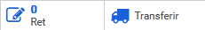

La primera opción mostrará las retenciones creadas que correspondan a
dicha factura.

La segunda opción va a aparecer para los clientes que estén usando el
módulo de inventario, sirve para crear un movimiento de inventario para
reducir o aumentar el stock.

**Compartir:** Esta acción nos permite enviar el documento a uno o más
de los destinatarios designados, dichos destinatarios deben tener
registrado su correo electrónico en su perfil de contacto.

.. image:: ../static/images/6/accionesproveedor.png

.. image:: ../static/images/6/compartirdocproveedor.png

**Procesar XML:** Esta opción permitirá procesar datos de un documento
con extensión XML al sistema; primero se debe subir el archivo y después
de que el archivo esté cargado, de manera automática el sistema llenará
los campos con los datos del XML. Si el proveedor no existe, creará de
manera automática los datos de este y los utilizará a la vez en el
documento.

.. image:: ../static/images/6/subirxmlproveedor.png