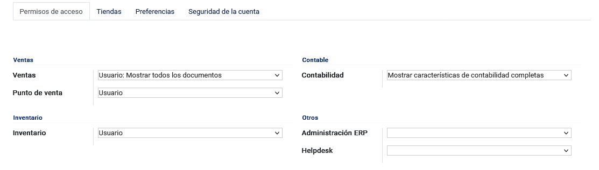
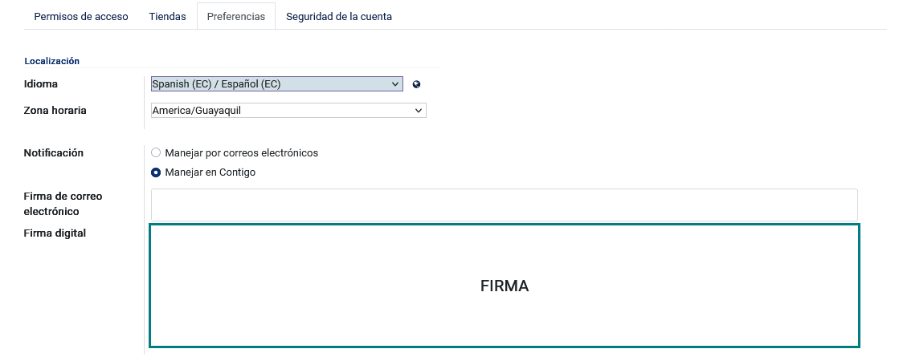
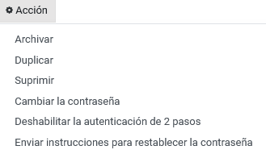
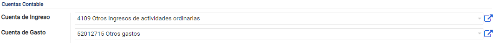
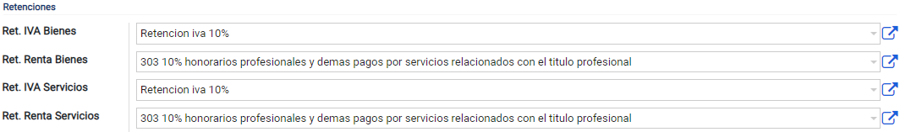
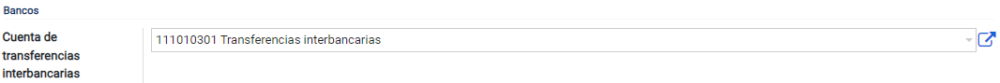
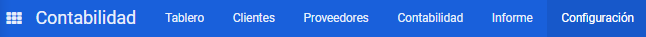

Configuración Inicial
=====================

Creación de Usuarios
--------------------

**Datos del usuario**: Esta tarea solo puede ser realizada por el administrador, debe dirigirse al módulo de **Ajustes**,
seleccionar en el menú la opción **Usuarios y Compañías** y seguido la opción **Usuarios**. Para crear un usuario,
se debe llenar los campos Nombre, Dirección de email y foto (opcional) con un tamaño máximo de 1024x1024px.

.. image:: ../static/images/2/datosusuario.png
    :align: center

**Activación del usuario:** En la esquina superior del mismo formulario nos encontraremos con un recuadro que indica si el usuario creado ha confirmado su inicio de sesión, caso contrario, se mostrará “nunca se conecta”.

.. image:: ../static/images/2/nuncaseconecta.png
    :align: center

Esta barra de estado nos indicará si el usuario no se ha conectado desde
su creación, pero en el caso de que se haya conectado, la barra cambiará
de “Nunca se conecta” a “Confirmado”.

.. image:: ../static/images/2/confirmadouser.png
    :align: center

**Permisos de acceso**: Parte fundamental del sistema, que se encarga de
la administración de los privilegios del usuario; dependiendo de los
permisos concedidos, el usuario realizará o no actividades en el
sistema.

**Tiendas**: El sistema permite gestionar las sucursales en que el
usuario se encuentra actualmente, para más información de las sucursales
revisar la opción **Agencia**.

**Preferencias**: Nos permite seleccionar para cada usuario el
idioma, la zona horaria, el medio de entrega de notificaciones, la
plantilla de firma y la firma digital(opcional).

**Seguridad de la cuenta**: Nos permite seleccionar la autenticación de dos pasos para
proteger la cuenta.

.. image:: ../static/images/2/security.png

**Acciones**: Nos permite archivar, suprimir, duplicar y cambiar la contraseña de dicho usuario, desactivar
la autenticación de dos pasos y también nos permite ayudar al usuario a
recuperar su contraseña enviando instrucciones para el restablecimiento
de la misma.

En caso de cambiar la contraseña se abrirá una ventana emergente, donde
se deberá digitar la nueva contraseña y seguidamente guardar los nuevos
datos.

.. image:: ../static/images/2/changepassword.png

En la parte superior, antes de las opciones de crear o editar usuario
tenemos una barra que permite “Enviar un correo de invitación”:

Al usuario se le enviará por correo una invitación para que ingrese al
sistema, si todo sale bien y la invitación se envía con éxito mostrará
un mensaje confirmando dicha acción.

**Nota Importante**: Antes de enviar el correo de invitación, primero se
debe configurar el correo saliente del sistema; para más información
revisar Configuración de **Correo Saliente**.

Plan Contable
-------------

Debe dirigirse al módulo de **Contabilidad**, seleccionar el menú de
**Configuración**, buscar el apartado de **Contabilidad** y seleccionar
la opción **Plan de Cuentas**.

El plan contable en Ecuador es un conjunto de normas y directrices que
regulan la forma en que las entidades deben registrar y presentar sus
transacciones financieras y contables. Basado en estándares
internacionales adaptados a las regulaciones locales, el plan define
cuentas contables, códigos numéricos, reglas de registro y formatos de
estados financieros. Su objetivo es estandarizar la información contable
para facilitar la comparabilidad y comprensión de los estados
financieros por parte de diversos usuarios. Este plan puede actualizarse
para reflejar cambios en las normativas y necesidades locales, y es
esencial para mantener la precisión e integridad de la información
financiera.

Estas cuentas deben estar ordenadas y codificadas de forma sistemática
para facilitar la contabilidad. Además, permite que todas las cuentas y
registros sean presentados y visualizados con la finalidad de
verificarlos. De esa forma, se elaboran con facilidad los estados
financieros.

.. image:: ../static/images/2/planctauno.png

El sistema Contigo tiene los datos básicos del
plan contable, pero es necesario verificar cuáles son las cuentas
contables que utilizará la empresa; en el caso de que se necesite añadir
más cuentas contables, se debe seguir la secuencia correspondiente del
código.

En el caso de querer visualizar más información respecto a una cuenta en
específico, deberá dar clic al botón “Configurar”, de esta manera se
abrirá una vista formulario en el cual podrá visualizar tanto el código,
el nombre de la cuenta, el tipo de la misma, pero habrá campos
adicionales como:

.. image:: ../static/images/2/planctados.png

.. image:: ../static/images/2/planctatres.png

**Tipo**: Aquí se define el tipo de cuenta, ya sean capitales, activos,
pasivos; cabe recalcar que las cuentas por cobrar y pagar deberán
definirse de manera correcta y darle el respectivo permiso de
conciliación.

**Impuestos determinados**: En esta opción se mostrará diferentes
porcentajes de impuesto a usar si son compras o ventas.

**Etiquetas**: Ayuda a definir qué tipo de actividad es, ya sea de
operaciones, financiera o actividades extraordinarias.

**Diarios permitidos**: Se definen los diarios contables que pueden ser
usados dentro de ese plan contable. Si se llena esta opción sólo podrán
usar dichas cuentas siempre y cuando el asiento contable posea dicho
diario.

**Obsoleto**: De igual manera no es posible eliminar una cuenta una vez
que se haya registrado una transacción en ella. Puede hacerla
inutilizable deberá marcar el check de **“Obsoleto”**.

**Grupo**: Se define automáticamente, en este apartado se define a qué
grupo de cuenta pertenece (grupo previamente creado).

**Centralizado**: En el caso de que se desee que se muestren los
detalles de la cuenta en el libro mayor, deberá marcar esta opción.

El sistema Contigo permite de igual manera visualizar las cuentas según
su nivel, el nivel lo define de manera automática siempre y cuando se
digite el código de la cuenta contable.

Por ejemplo, en la imagen de arriba solo se están visualizando las
cuentas nivel 1.

Grupos de cuentas
-----------------

Debe dirigirse al módulo de **Contabilidad**, seleccionar el menú de
**Configuración**, buscar el apartado de **Contabilidad** y seleccionar
la opción **Grupos de Cuentas**.

Los grupos de cuentas sirven para listar múltiples cuentas como
subcuentas de una cuenta más grande y, por lo tanto, consolidar reportes
como la balanza de comprobación. De forma predeterminada, los grupos se
gestionan según el código del grupo.

Para la creación de un grupo de cuentas, se deberá definir el nombre de
la misma y el prefijo de esta; dependiendo de los dígitos seleccionados
al momento de guardar el registro el sistema enlazará todas las cuentas
contables que posean dicho prefijo.

.. image:: ../static/images/2/grupoctas.png

Impuestos
---------

Esta tarea solo puede ser realizada por el administrador, debe dirigirse
al módulo de **Contabilidad**, seleccionar el menú de **Configuración**,
buscar el apartado de **Contabilidad** y seleccionar la opción
**Impuestos**.

Los impuestos son tributos que cada persona, familia o empresa debe
pagar al Estado para costear las necesidades colectivas, contribuyendo
así con una parte de sus ingresos.

Al momento de crear un nuevo impuesto es necesario agregar el nombre del
impuesto, si se desea se puede añadir un nombre corto y seleccionar el
ámbito de este (ventas, compras, ninguno y ajustes).

.. image:: ../static/images/2/impuestosuno.png

**Definición**: Esta pestaña nos ayuda a determinar el cálculo
del impuesto, su importe, la cuenta de impuestos y la cuenta de
impuestos para las notas de crédito.

.. image:: ../static/images/2/impuestosdos.png

**Opciones avanzadas**:
Esta opción nos permite añadir la etiqueta de factura, el grupo de
impuestos, si se debe incluir en el precio, si tiene base imponible y
añadir más etiquetas para reconocimiento de este.

.. image:: ../static/images/2/impuestostres.png

**Código de impuestos**: Nos permite ingresar el código base y el código de
impuestos para las ventas y compras; de la misma manera el reembolso de
ventas y compras con la diferencia del código de devoluciones.

.. image:: ../static/images/2/impuestosfour.png

Información de la compañía
--------------------------

Esta tarea solo puede ser realizada por el administrador, debe dirigirse
al módulo de **Administración**, seleccionar la opción **Compañías**.
Por defecto hay un registro con el nombre de My Company (Rio Tinto
Group), es necesario ingresar a dicho registro para poder configurar con
los respectivos datos de la empresa.

Proceden a llenar cada uno de los campos con su respectiva información
según la empresa, especialmente los campos obligatorios empezando por el
nombre de la compañía.

.. image:: ../static/images/2/companyuno.png

**Información General**: Se debe registrar todos los datos de la
compañía y si la compañía posee factura electrónica, llenar en el
sistema sus respectivos campos para su posterior utilización.

.. image:: ../static/images/2/companydos.png

**Contabilidad**: Nos permite indicar al sistema las retenciones,
sustentos tributarios, las cuentas contables y la cuenta de
transferencia entre bancos que la empresa utiliza para toda su actividad
contable.

.. image:: ../static/images/2/contres.png

.. image:: ../static/images/2/contfour.png

.. image:: ../static/images/2/contseis.png

**Agencia** Esta tarea puede ser realizada por el administrador, debe
dirigirse al módulo de **Administración**, seleccionar la opción
**Agencia**.

.. image:: ../static/images/2/moduloagencia.png

.. image:: ../static/images/2/crearagencia.png

Configuración de correo saliente
--------------------------------
Nos dirigimos al módulo de **Administración** y buscamos en el
menú **Servidor de Correo Saliente**.

.. image:: ../static/images/2/modulocorreosaliente.png

Para crear el servidor de correo saliente, añadimos una descripción de nuestro correo y
seleccionamos su prioridad (entre más bajo el número mayor será la
prioridad); en la información de la conexión colocamos:

**Servidor SMTP =** smtp.dominio.com

**Puerto SMTP =** 465

Por último, se selecciona en seguridad de la conexión SSL/TLS y
posteriormente se configura el usuario y la contraseña del correo, se
prueba la conexión y listo.

.. image:: ../static/images/2/crearcorreosaliente.png

.. image:: ../static/images/2/vistacorreosaliente.png

Creación de año fiscal y periodos
---------------------------------
Nos dirigimos al módulo de **Contabilidad**, seleccionamos el menú de **Configuración**, buscamos
Facturación y seleccionamos **Año Fiscal**.

.. image:: ../static/images/2/moduloañofiscal.png

.. image:: ../static/images/2/añofiscal.png

Para crear el año fiscal en curso, colocar en “Nombre” el año,
configurar la fecha de inicio y fecha de finalización del año y dar clic
en “Crear”.

Configuración de Punto de Emisión
---------------------------------

Nos dirigimos al módulo de **Contabilidad**, seleccionamos el menú de
**Configuración**, buscamos **Facturación** y por último seleccionamos
**Puntos de Emisión**.

.. image:: ../static/images/2/añofiscal.png

.. image:: ../static/images/2/añofiscal.png

Configurar el punto de emisión que viene por defecto, en el punto de
emisión requiere introducir un nombre, un código, seleccionar el estado
si es activo, la agencia y el ambiente. Además, se puede enviar el
documento por medio electrónico.

.. image:: ../static/images/2/añofiscal.png

Cuentas Bancarias
-----------------
En el módulo de **Contabilidad**, seleccionamos el menú de **Configuración**, buscamos el apartado de
**Bancos** y escogemos la opción **Agregar una cuenta bancaria**.

.. image:: ../static/images/2/agregarcuentasbancarias.png

Para configurar las cuentas bancarias, ingresamos el número de cuenta,
el banco correspondiente y el código de identificación bancaria. El
banco se asocia a la empresa.

.. image:: ../static/images/2/crearcuentabancaria.png

.. image:: ../static/images/2/cuentaasociadaempresa.png

Diarios
-------

En el módulo de **Contabilidad**, seleccionamos el menú de
**Configuración** y posteriormente el apartado de **Contabilidad** y
localizamos **Diarios Contables**.

.. image:: ../static/images/2/diarioscontables.png

En los diarios ingresamos el nombre, el tipo (venta, compra, banco,
efectivo o miscelánea) según corresponda, también nos permite
seleccionar el tipo de cuenta deudora o acreedora si aquella cuenta no
está registrada, se puede crear o editar.

También se configura el código corto y la secuencia de los
asientos. Se define las cuentas de débito y crédito por defecto; también
se puede seleccionar el producto, podemos elegir: caja chica,
liquidación de gastos o tarjeta de crédito; podemos seleccionar el tipo
de producto que está en descuento, si no está registrado nos permite
crear y editar, también nos indica si aquella cuenta bancaria
corresponde a cuenta corriente o ahorros y guardamos.

.. image:: ../static/images/2/apartadoasientoscontables.png

.. image:: ../static/images/2/vistadiarioscontables.png

Primeros Pasos
==============

Ingreso al sistema
------------------
Nos dirigiremos a la URL del dominio que tenemos en la nube, en nuestro
caso será “https://dominio.manexware.com”, al momento de ingresar a
dicho dominio aparecerá la siguiente pantalla.

.. image:: ../static/images/2/pantallainiciosesioncontigo.png

Se coloca tanto el usuario y contraseña, después deberá dar clic en iniciar sesión. Si
el usuario existe en el sistema automáticamente le mostrará el menú
principal del sistema, en el caso de que el usuario no exista deberá
contactar con el **administrador** encargado.

Para el caso en que el usuario olvide su contraseña, debajo del botón
**“Iniciar Sesión”** se encuentra la opción de **“Recuperar Contraseña”
(Reset Password)**.

.. image:: ../static/images/2/restablecercontraseña.png

**Recuperar Contraseña**: El proceso de recuperación de contraseña
enviará un correo al usuario, a la dirección email previamente
configurada.

.. image:: ../static/images/2/correorecuperarpassword.png

.. image:: ../static/images/2/enviodecorreorestablecer.png

Al momento de recibir el correo, se deberá dar clic en **“Cambiar
Contraseña”** y el sistema lo enviara a la pantalla de cambio de clave.

.. image:: ../static/images/2/pantallacambiodeclave.png

Al colocar la nueva contraseña es necesario volver al inicio e ingresar
con el usuario y la nueva contraseña que se ha definido.

Preferencias de usuario
-----------------------

Una vez ingresado al sistema, en la esquina superior derecha, se
encuentra el ícono de nuestro usuario, al momento de dar clic en él nos
saldrá una serie de opciones:

.. image:: ../static/images/2/userpreferencias.png

**Atajo:** Muestra atajos del teclado que pueden ser utilizados para
interactuar con el sistema.

.. image:: ../static/images/2/atajosteclado.png

**Preferencias**: Permiteseleccionar el idioma, la zona horaria, definir por cuál medio le
llegaran las notificaciones a dicho usuario, la posición de la barra de
los módulos, la posición del chatter y su firma.

.. image:: ../static/images/2/preferenciasuser.png

De igual manera se podrá definir en la sección “Seguridad de la cuenta”
el cambio de contraseña y si se requiere se podrá utilizar la
autenticación de dos pasos.

.. image:: ../static/images/2/userseguridadcuenta.png

**Cerrar Sesión**: Nos devuelve almenú de inicio de sesión.

.. image:: ../static/images/2/cerrarsesionscreen.png

Contactos
---------

Permite añadir cualquier tipo de contactos ya sean clientes o
proveedores. En el contacto se puede establecer la imagen o foto que se
lo identifica, seleccionar si este corresponde a una persona o compañía,
el nombre de la empresa o compañía a la que pertenece, si no está
registrada se puede crear o editar, de igual manera se podrá ingresar la
dirección, la provincia, la parroquia, etc. Se puede seleccionar el tipo
de identificación (cédula, Ruc, pasaporte, o Desconocido/Unknown), una
vez que se selecciona cédula o Ruc el sistema indicara que se debe
insertar los números de dichos identificadores, se podrá seleccionar si
la persona es natural o jurídica, el tipo de sexo, el estado civil, el
puesto de trabajo, teléfono, móvil, el correo electrónico, el nombre del
sitio web, el título, el idioma, el tipo de cliente si es público o
privado, la zona horaria o la etiqueta, ver sus facturas, las cuentas
analíticas relacionadas, conciliaciones, opciones de compra y venta y la
creación de usuarios. Para más información revisar el módulo
**Contactos**.

.. image:: ../static/images/2/crearcontactos.png

Uso de Barra de Filtros
-----------------------

El sistema cuenta con cuatro tipos de filtros y cada uno cumple una
función específica.

.. image:: ../static/images/2/barradefiltros.png

**Filtro por defecto**: Al momento de ingresar algún carácter en la
barra de filtros de manera automática el sistema arrojará una serie de
etiquetas que sirven para identificar de manera rápida lo que se está
buscando.

.. image:: ../static/images/2/filtropordefecto.png

**Filtros**: Muestran una serie de etiquetas predefinidas en la
programación del sistema, que ayuda al usuario a buscar la información
exacta, el filtro se activará si seleccionas cómo filtrar en la
búsqueda, dependiendo de lo que selecciones aparecerá una etiqueta en la
barra de búsqueda.

.. image:: ../static/images/2/filtros.png

**Filtros personalizados**: Esta opción permite al usuario añadir
diferentes condiciones a la búsqueda o generar nuevos campos de
búsqueda, también permite agregar condiciones para un mejor resultado.

.. image:: ../static/images/2/filtropersonalizado.png

.. image:: ../static/images/2/filtropersonalizadodos.png

**Agrupar por**: Permite agrupar la información deseada o relacionada,
dependiendo del modo de agrupación que el usuario le indique al sistema.

.. image:: ../static/images/2/agruparpor.png

**Agrupar Por personalizados**: Esta opción permite al usuario añadir
diferentes condiciones a la búsqueda o generar nuevos campos de
búsqueda, también permite agregar condiciones para un mejor resultado.

.. image:: ../static/images/2/agruparpersonalizado.png

**Favoritos**: Permite guardar una búsqueda personalizada y utilizarla
cuando se lo requiera, solamente se añade el nombre de la búsqueda (ya
sea una búsqueda por filtro o agrupación) e indicas si deseas utilizar
dicha búsqueda por defecto y/o si quieres compartirlo con otros
usuarios.

.. image:: ../static/images/2/favoritos.png

**Número de resultados**: Indica el número total de resultados, este
puede modificarse en el caso de realizar tareas que lo requieran.

.. image:: ../static/images/2/numeroderesultados.png

En este ejemplo, le indicamos al sistema que se querrá visualizar los
resultados existentes desde el 1 (primero) hasta el 220 (último).

.. image:: ../static/images/2/numeroderesultados2.png

Tipos de Vistas
---------------

El sistema cuenta con múltiples tipos de vistas, que facilitan la
búsqueda de información y el procesamiento visual de la misma. Estas
vistas son las siguientes:

**Vista Actividad**: La vista Actividad se usa para mostrar las
actividades vinculadas a los registros. Los datos se muestran en un
gráfico con los registros que forman las filas y la actividad son las
columnas. La primera celda de cada fila muestra una tarjeta que
representa el registro correspondiente. Al hacer clic en otras celdas,
se muestra una descripción detallada de todas las actividades del mismo
tipo para el registro.

.. image:: ../static/images/2/vistaactividad.png

**Vista Formulario**: Las vistas de formulario se utilizan para mostrar los datos de un solo registro,
siendo la vista más usada el sistema.

.. image:: ../static/images/2/vistaformulario.png

**Vista Kanban**: La vista Kanban es una visualización de tablero Kanban; muestra registros
como “tarjetas”, a medio camino entre una vista de lista y una vista de
formulario no editable. Los registros pueden agruparse en columnas para
su uso en la visualización o manipulación del flujo de trabajo (por
ejemplo, tareas o gestión del progreso del trabajo), o desagruparse
(usarse simplemente para visualizar registros).

.. image:: ../static/images/2/vistakanban.png

**Vista Lista**: Muestra los múltiples registros en forma de lista.

.. image:: ../static/images/2/vistalista.png

**Nota**: Si deseas saber en qué tipo de vista estas, dirígete a la
esquina superior derecha, pasas el ratón en los diferentes tipos vistas
que se muestran y el sistema te arrojará el nombre de la vista.

Acciones
--------

Como su propio nombre indica son procesos que el usuario podrá realizar
en uno o múltiples registros, las acciones más comunes son las de
Suprimir y Duplicar, dependiendo del módulo en que te encuentres; pueden
tener más de una acción en el módulo y éstas nos permitirán realizar
actividades de manera más rápida, dependiendo de su función asignada en
el sistema.

.. image:: ../static/images/2/accionesbarra.png

Mensajes de error
-----------------

Los mensajes de error son parte esencial del sistema, es un medio de
ayuda para que los usuarios sepan que lo que están realizando es
correcto. Aunque los mensajes se dividen dependiendo del tipo de
actividad, todos tienen la misma funcionalidad, la de indicar al usuario
si la acción está permitida o no; ya sean mensajes de error referentes a
permisos de usuario o falta de campos en uno de los formularios e
inclusive el tipo de dato que este requiere.

.. image:: ../static/images/2/mensajesdeerror.png

Conversaciones
==================

Uso y configuración inicial
---------------------------

El módulo de Conversaciones permite unificar todas las comunicaciones de
la empresa a través de mensajes, notas y chat. En todas las
aplicaciones, puede compartir información, proyectos, archivos,
priorizar tareas y mantenerse conectado con colegas y socios. Este
módulo le permite mejorar las relaciones, aumentar la productividad y la
transparencia al promover una forma conveniente de comunicación.

A la hora de configurar el usuario en los ajustes debemos elegir cómo
nos llegarán las notificaciones del sistema: por correo electrónico o
vía Contigo.

.. image:: ../static/images/2/preferenciasdelacuenta.png

Para utilizar de manera óptima el módulo de conversaciones es
recomendable que la gestión de notificaciones esté manejada por Contigo.

Manejo Apropiado
----------------
Los mensajes recibidos de parte de otros usuarios serán mostrados en la parte izquierda del programa, mientras
que en la parte derecha se podrá observar dicho mensaje; los mensajes se
pueden marcar como por realizar e inclusive nos permitirán etiquetar a
los usuarios dentro del sistema. Al momento de ingresar en bandeja de
entrada, nos mostrará todos los mensajes que el usuario ha recibido y
habilitará un botón que nos permitirá marcarlos como leído. Si un
mensaje está marcado como “por realizar” de manera automática es
agregado en destacados.

.. image:: ../static/images/2/bandejadeentrada.png

Contigo Bot
-----------

La primera vez que inicia sesión en su cuenta, ContigoBot le envía un
mensaje solicitando permiso para recibir notificaciones de escritorio
para los chats. Si se acepta, recibirá notificaciones automáticas de los
mensajes que se le envíen independientemente de dónde se encuentre en
Contigo.

.. image:: ../static/images/2/contigobot.png

Interaccion entre usuarios
--------------------------

Para mencionar a un usuario dentro de un chat o el tipo de charla @
nombre-usuario; para hacer referencia a un canal, escriba #
nombre-canal. Se envía una notificación al usuario mencionado a su
bandeja de entrada o por correo electrónico, dependiendo de su
configuración. Mencionar a un usuario en la charla lo configura como
seguidor del elemento (si aún no lo está) y enviará un mensaje a su
bandeja de entrada. El elemento que contiene la mención también
aparecerá en negrita en la vista de lista. Mencionar a un usuario en un
canal enviará un mensaje a su bandeja de entrada. No puedes mencionar a
un usuario en un canal en el que no esté suscrito.

.. image:: ../static/images/2/interaccionesdeusuarios.png

Canales
--------
Puede utilizar canales para organizar debates entre equipos,
departamentos, proyectos o cualquier otro grupo que requiera una
comunicación regular. De esta manera, mantendrá a todos al tanto de las
últimas novedades. Canales públicos o privados: Todo el mundo puede ver
un canal público, mientras que un canal privado solo es visible para los
usuarios invitados. Para crear un canal nos dirigiremos en la opción
canales y damos clic en el signo +

.. image:: ../static/images/2/canales.png

La opción ¿Quién puede seguir las actividades del grupo? le permite
controlar qué grupos pueden tener acceso al canal. Tenga en cuenta que
permitir que todos sigan un canal privado permite que otros usuarios lo
vean y se unan, como lo harían con uno público. Si elige Solo personas
invitadas, vaya a la pestaña Miembros para agregar a sus miembros, o
vaya a la página principal de Discusión, seleccione el canal y haga clic
en Invitar.

Para el grupo de usuarios seleccionado, la opción Suscribir
automáticamente grupos agrega automáticamente a sus miembros como
seguidores. En otras palabras, mientras que los Grupos autorizados
limitan qué usuarios pueden acceder al canal, los Grupos de suscripción
automática agregan automáticamente al usuario como miembro siempre que
forme parte del grupo.

La elección de Enviar mensajes por correo electrónico configura el canal
para que se comporte como una lista de correo. Habilitar esta opción le
permite moderar este canal, lo que significa que los mensajes deberán
ser aprobados antes de enviarse.

Conversación/ canales públicos
-------------------------------

.. image:: ../static/images/2/canalespublicos.png

.. image:: ../static/images/2/descripcanalespublicos.png

Conversación entre Usuarios
---------------------------

Los mensajes directos son mensajes privados que sólo pueden ser vistos
por el remitente y el destinatario. Puede enviar mensajes directos a
otros usuarios desde el módulo Discusión creando una nueva conversación
o seleccionando una existente en la barra lateral. Los mensajes directos
se pueden enviar desde cualquier lugar en Contigo usando el icono de
burbuja de diálogo en la barra superior. El estado en línea de otros
usuarios se muestra a la izquierda de su nombre. Un punto verde indica
que un usuario está conectado, un punto naranja que está inactivo y un
punto gris que está desconectado.

.. image:: ../static/images/2/usersconversaciones.png

Enviar Mensaje
---------------
De lamisma manera que en una conversación entre usuarios dentro de un canal,
esta opción nos permitirá enviar a los seguidores asignados del registro
un mensaje para indicar cualquier procedimiento, adjunto, entre otros y
que los seguidores aprendan a como interactuar con dicho registro.

.. image:: ../static/images/2/enviarmensajes.png

Poner Adjuntos
---------------
Los adjunto son recopilaciones deacciones realizadas en el sistema. Estas se llenan dependiendo de las
acciones del usuario en determinados procesos, también es posible
generar notas en el sistema para que los restantes de usuarios las vean
inclusive se podrá adjuntar imágenes, dichas notas no serán posibles de
eliminar, ya que es un registro de las actividades realizadas por los
usuarios del sistema.

.. image:: ../static/images/2/poneradjuntos.png

Planificar actividad
--------------------
La planificación de actividades es la manera perfecta de mantenerse al día
con su trabajo. Recuerde lo que debe hacerse y programe las próximas
actividades a realizar. Tus actividades están disponibles en cualquier
lugar de Contigo. Es fácil administrar sus prioridades. Varios tipos de
actividades genéricas están disponibles de forma predeterminada en
Contigo (por ejemplo, llamada, correo electrónico, reunión, etc.). Las
actividades están planificadas para días específicos. Si necesita
establecer un horario, elija el tipo de actividad Reunión. Al programar
uno, el calendario simplemente se abrirá para permitirle seleccionar un
intervalo de tiempo.

.. image:: ../static/images/2/planificaractividad.png

.. image:: ../static/images/2/vistaactividades.png

Si el usuario registrado tiene alguna actividad pendiente a realizar,
este podrá observar en el icono de reloj que se encuentra en la parte
superior derecha.

.. image:: ../static/images/2/iconoreloj.png

.. image:: ../static/images/2/actpendiente.png

Si la actividad se encuentra en una fecha posterior, se marcará como
futuro, si la actividad está programada para el mismo día esta nos
marcará como hoy, pero si la actividad se encuentra atrasada nos marcará
como atrasado.

Adjuntos
--------

El sistema nos permite adjuntar todo tipo de archivos, para que los
adjuntos se suban o se descarguen de forma rápida es recomendable que el
archivo a adjuntar sea ligero. Dependiendo del número de adjuntos en la
nota dentro del registro, dicho número se verá reflejado en el icono de
clic de la parte superior derecha.

.. image:: ../static/images/2/adjuntosyseguidores.png

Seguidores
----------

Podremos añadir seguidores en nuestro registro, de forma tal que ellos
puedan tener acceso para ver la información, notas, adjuntos y otros
datos; de igual manera que en los adjuntos, el sistema nos mostrará en
la parte superior derecha el número de seguidores, permitiéndonos añadir
a más usuarios y también a eliminarlos.

.. image:: ../static/images/2/adjuntosyseguidores.png

Contactos
==========
