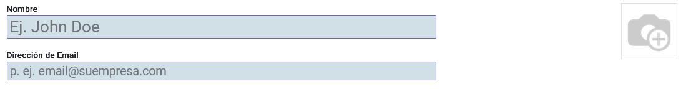
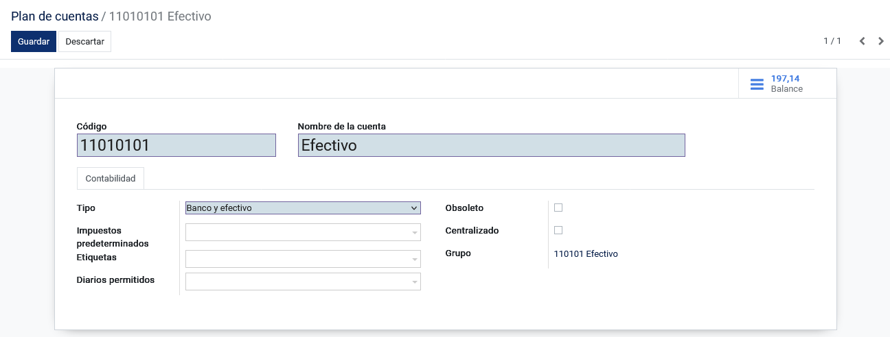
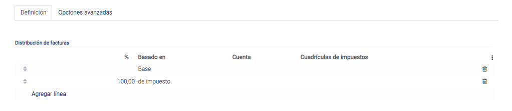
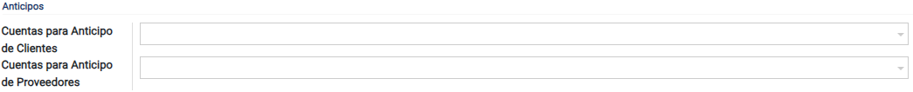
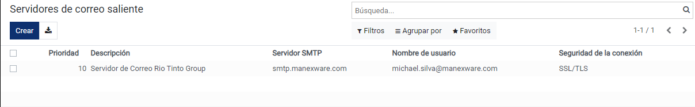

Configuración Inicial
=====================

Creación de Usuarios
--------------------

**Datos del usuario**: Esta tarea solo puede ser realizada por el administrador, es necesario acceder al área de Administracion, luego elegir la pestaña Usuarios y Compañías en el menú, y a continuación, hacer clic en la opción Usuarios.
Para crear un usuario,se debe llenar los campos Nombre, Dirección de email y foto (opcional) con un tamaño máximo de 1024x1024px.

**Activación del usuario:** En la esquina superior del mismo formulario se habilitara con un recuadro que indica si el usuario creado ha confirmado su inicio de sesión, caso contrario, se mostrará “Nunca se conecta”.

.. image:: ../static/images/2/nuncaseconecta.png
    :align: center

Esta barra de estado nos indicará si el usuario no se ha conectado desde
su creación, pero en el caso de que se haya conectado, la barra cambiará
de “Nunca se conecta” a “Confirmado”.

.. image:: ../static/images/2/confirmadouser.png
    :align: center

**Permisos de acceso**: Parte fundamental del sistema, que se encarga de
la administración de los privilegios del usuario; dependiendo de los
permisos concedidos, el usuario realizará o no actividades en el
sistema.

.. image:: ../static/images/2/permisosaccess.png
    :align: center

**Tiendas**: El sistema permite gestionar las sucursales en que el
usuario se encuentra actualmente, para más información de las sucursales
revisar la opción :ref:`Agencias`.

.. image:: ../static/images/2/agencies.png
    :align: center

**Preferencias**: Nos permite seleccionar para cada usuario el
idioma, la zona horaria, el medio de entrega de notificaciones, la
plantilla de firma y la firma digital(opcional).

.. image:: ../static/images/2/preferencias.png
    :align: center
**Seguridad de la cuenta**: Nos permite seleccionar la autenticación de dos pasos para
proteger la cuenta.

.. image:: ../static/images/2/security.png
    :align: center
**Acciones**: Nos permite archivar, suprimir, duplicar y cambiar la contraseña de dicho usuario, desactivar
la autenticación de dos pasos y también nos permite ayudar al usuario a
recuperar su contraseña enviando instrucciones para el restablecimiento
de la misma.

.. image:: ../static/images/2/acciones.png
    :align: center

.. note::
    En caso de cambiar la contraseña se abrirá una ventana emergente, donde
    se deberá digitar la nueva contraseña y seguidamente guardar los nuevos
    datos.

.. image:: ../static/images/2/changepassword.png
    :align: center
En la parte superior, antes de las opciones de crear o editar usuario
tenemos una barra que permite “Enviar un correo de invitación”:

.. image:: ../static/images/2/correoinvitacion.png
    :align: center
Al usuario se le enviará por correo una invitación para que ingrese al
sistema, si todo sale bien y la invitación se envía con éxito mostrará
un mensaje confirmando dicha acción.

.. note::
    Antes de enviar el correo de invitación, primero se
    debe configurar el correo saliente del sistema; para más información
    revisar Configuración de **Correo Saliente**.

Plan Contable
-------------

Debe dirigirse al módulo de **Contabilidad**, seleccionar el menú de
**Configuración**, buscar el apartado de **Contabilidad** y seleccionar
la opción **Plan de Cuentas**.

El plan contable en Ecuador es un conjunto de normas y directrices que
regulan la forma en que las entidades deben registrar y presentar sus
transacciones financieras y contables. Basado en estándares
internacionales adaptados a las regulaciones locales, el plan define
cuentas contables, códigos numéricos, reglas de registro y formatos de
estados financieros. Su objetivo es estandarizar la información contable
para facilitar la comparabilidad y comprensión de los estados
financieros por parte de diversos usuarios. Este plan puede actualizarse
para reflejar cambios en las normativas y necesidades locales, y es
esencial para mantener la precisión e integridad de la información
financiera.

Estas cuentas deben estar ordenadas y codificadas de forma sistemática
para facilitar la contabilidad. Además, permite que todas las cuentas y
registros sean presentados y visualizados con la finalidad de
verificarlos. De esa forma, se elaboran con facilidad los estados
financieros.

El sistema Contigo tiene los datos básicos del
plan contable, pero es necesario verificar cuáles son las cuentas
contables que utilizará la empresa; en el caso de que se necesite añadir
más cuentas contables, se debe seguir la secuencia correspondiente del
código.

En el caso de querer visualizar más información respecto a una cuenta en
específico, deberá dar clic al botón “Configurar”, de esta manera se
abrirá una vista formulario en el cual podrá visualizar tanto el código,
el nombre de la cuenta, el tipo de la misma, pero habrá campos
adicionales como:

.. image:: ../static/images/2/planctados.png
    :align: center

**Tipo**: Aquí se define el tipo de cuenta, ya sean capitales, activos,
pasivos; cabe recalcar que las cuentas por cobrar y pagar deberán
definirse de manera correcta y darle el respectivo permiso de
conciliación.

**Impuestos predeterminados**: En esta opción se mostrará diferentes
porcentajes de impuesto a usar si son compras o ventas.

**Etiquetas**: Ayuda a definir qué tipo de actividad es, ya sea de
operaciones, financiera o actividades extraordinarias.

**Diarios permitidos**: Se definen los diarios contables que pueden ser
usados dentro de ese plan contable. Si se llena esta opción sólo podrán
usar dichas cuentas siempre y cuando el asiento contable posea dicho
diario.

**Obsoleto**: De igual manera no es posible eliminar una cuenta una vez
que se haya registrado una transacción en ella. Puede hacerla
inutilizable deberá marcar el check de **“Obsoleto”**.

**Grupo**: Se define automáticamente, en este apartado se define a qué
grupo de cuenta pertenece (grupo previamente creado).

**Centralizado**: En el caso de que se desee que se muestren los
detalles de la cuenta en el libro mayor, deberá marcar esta opción.

El sistema Contigo permite de igual manera visualizar las cuentas según
su nivel, el nivel lo define de manera automática siempre y cuando se
digite el código de la cuenta contable.

.. image:: ../static/images/2/nivelescta.png
    :align: center

Por ejemplo, en la imagen de arriba solo se están visualizando las
cuentas nivel 1.

Grupos de cuentas
-----------------

Debe dirigirse al módulo de **Contabilidad**, seleccionar el menú de
**Configuración**, buscar el apartado de **Contabilidad** y seleccionar
la opción **Grupos de Cuentas**.

Los grupos de cuentas sirven para listar múltiples cuentas como
subcuentas de una cuenta más grande y, por lo tanto, consolidar reportes
como la balanza de comprobación. De forma predeterminada, los grupos se
gestionan según el código del grupo.

Para la creación de un grupo de cuentas, se deberá definir el nombre de
la misma y el prefijo de esta; dependiendo de los dígitos seleccionados
al momento de guardar el registro el sistema enlazará todas las cuentas
contables que posean dicho prefijo.

.. image:: ../static/images/2/grupoctas.png
    :align: center

Impuestos
---------

Esta tarea solo puede ser realizada por el administrador o por quien tenga la autorización financiera más alta, debe dirigirse
al módulo de **Contabilidad**, seleccionar el menú de **Configuración**,
buscar el apartado de **Contabilidad** y seleccionar la opción
**Impuestos**.

Los impuestos son tributos que cada persona, familia o empresa debe
pagar al Estado para costear las necesidades colectivas, contribuyendo
así con una parte de sus ingresos.

Al momento de crear un nuevo impuesto es necesario agregar el nombre del
impuesto, si se desea se puede añadir un nombre corto y seleccionar el
ámbito de este (ventas, compras, ninguno y ajustes).

.. image:: ../static/images/2/impuestosuno.png
    :align: center

**Definición**: Esta pestaña nos ayuda a determinar el cálculo
del impuesto, su importe, la cuenta de impuestos y la cuenta de
impuestos para las notas de crédito.

**Opciones avanzadas**:
Esta opción nos permite añadir la etiqueta de factura, el grupo de
impuestos, si se debe incluir en el precio, si tiene base imponible y
añadir más etiquetas para reconocimiento de este.

.. image:: ../static/images/2/impuestostres.png
    :align: center

**Código de impuestos**: Nos permite ingresar el código base y el código de
impuestos para las ventas y compras; de la misma manera el reembolso de
ventas y compras con la diferencia del código de devoluciones.

.. image:: ../static/images/2/impuestosfour.png
    :align: center

Información de la compañía
--------------------------

Esta tarea solo puede ser realizada por el administrador, debe dirigirse
al módulo de **Administración**, seleccionar la opción **Compañías**.
Por defecto hay un registro con el nombre de My Company (Rio Tinto
Group), es necesario ingresar a dicho registro para poder configurar con
los respectivos datos de la empresa.

Proceden a llenar cada uno de los campos con su respectiva información
según la empresa, especialmente los campos obligatorios empezando por el
nombre de la compañía.

.. image:: ../static/images/2/companyuno.png
    :align: center

**Información General**: Se debe registrar todos los datos de la
compañía y si la compañía posee factura electrónica, llenar en el
sistema sus respectivos campos para su posterior utilización.

.. image:: ../static/images/2/companydos.png
    :align: center

.. image:: ../static/images/2/companytres.png
    :align: center

.. image:: ../static/images/2//companyfour.png
    :align: center

**Contabilidad**: Nos permite indicar al sistema las retenciones,
sustentos tributarios, las cuentas contables y la cuenta de
transferencia entre bancos que la empresa utiliza para toda su actividad
contable.

.. image:: ../static/images/2/contuno.png
    :align: center

.. image:: ../static/images/2/contdos.png
    :align: center

.. image:: ../static/images/2/contfour.png
    :align: center

.. image:: ../static/images/2/contfive.png
    :align: center

.. image:: ../static/images/2/contseis.png
    :align: center

.. image:: ../static/images/2/contsiete.png
    :align: center

.. image:: ../static/images/2/contocho.png
    :align: center

**Agencia** Esta tarea puede ser realizada por el administrador, debe
dirigirse al módulo de **Administración**, seleccionar la opción
**Agencia**.

.. image:: ../static/images/2/moduloagencia.png
    :align: center

.. image:: ../static/images/2/crearagencia.png
    :align: center

Configuración de correo saliente
--------------------------------
Nos dirigimos al módulo de **Administración** y buscamos en el
menú **Servidor de Correo Saliente**.

.. image:: ../static/images/2/modulocorreosaliente.png
    :align: center

Para crear el servidor de correo saliente, añadimos una descripción de nuestro correo y
seleccionamos su prioridad (entre más bajo el número mayor será la
prioridad); en la información de la conexión colocamos:

**Servidor SMTP =** smtp.dominio.com

**Puerto SMTP =** 465

Por último, se selecciona en seguridad de la conexión SSL/TLS y
posteriormente se configura el usuario y la contraseña del correo, se
prueba la conexión y listo.

.. image:: ../static/images/2/crearcorreosaliente.png
    :align: center

.. image:: ../static/images/2/conexionexitosacorreosaliente.png
    :align: center

Creación de año fiscal y periodos
---------------------------------
Nos dirigimos al módulo de **Contabilidad**, seleccionamos el menú de **Configuración**, buscamos
Facturación y seleccionamos **Año Fiscal**.

.. image:: ../static/images/2/moduloañofiscal.png
    :align: center

.. image:: ../static/images/2/añofiscal.png
    :align: center

Para crear el año fiscal en curso, colocar en “Nombre” el año,
configurar la fecha de inicio y fecha de finalización del año y dar clic
en “Crear”.

Configuración de Punto de Emisión
---------------------------------

Nos dirigimos al módulo de **Contabilidad**, seleccionamos el menú de
**Configuración**, buscamos **Facturación** y por último seleccionamos
**Puntos de Emisión**.

.. image:: ../static/images/2/puntodeemision.png
    :align: center

Configurar el punto de emisión que viene por defecto, en el punto de
emisión requiere introducir un nombre, un código, seleccionar el estado
si es activo, la agencia y el ambiente. Además, se puede enviar el
documento por medio electrónico.

.. image:: ../static/images/2/añofiscal.png
    :align: center

Cuentas Bancarias
-----------------
En el módulo de **Contabilidad**, seleccionamos el menú de **Configuración**, buscamos el apartado de
**Bancos** y escogemos la opción **Agregar una cuenta bancaria**.

.. image:: ../static/images/2/modulocuentasbancarias.png
    :align: center

.. image:: ../static/images/2/agregarcuentasbancarias.png
    :align: center

Para configurar las cuentas bancarias, ingresamos el número de cuenta,
el banco correspondiente y el código de identificación bancaria. El
banco se asocia a la empresa.

.. image:: ../static/images/2/crearcuentabancaria.png
    :align: center

.. image:: ../static/images/2/cuentaasociadaempresa.png
    :align: center

Diarios
-------

En el módulo de **Contabilidad**, seleccionamos el menú de
**Configuración** y posteriormente el apartado de **Contabilidad** y
localizamos **Diarios Contables**.

.. image:: ../static/images/2/modulodiariocontables.png
    :align: center

.. image:: ../static/images/2/diarioscontables.png
    :align: center

En los diarios ingresamos el nombre, el tipo (venta, compra, banco,
efectivo o miscelánea) según corresponda, también nos permite
seleccionar el tipo de cuenta deudora o acreedora si aquella cuenta no
está registrada, se puede crear o editar.

.. image:: ../static/images/2/creardiariocontable.png
    :align: center

También se configura el código corto y la secuencia de los
asientos. Se define las cuentas de débito y crédito por defecto; también
se puede seleccionar el producto, podemos elegir: caja chica,
liquidación de gastos o tarjeta de crédito; podemos seleccionar el tipo
de producto que está en descuento, si no está registrado nos permite
crear y editar, también nos indica si aquella cuenta bancaria
corresponde a cuenta corriente o ahorros y guardamos.

.. image:: ../static/images/2/apartadoasientoscontables.png
    :align: center

.. image:: ../static/images/2/vistadiarioscontables.png
    :align: center

