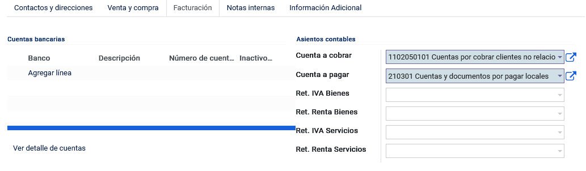
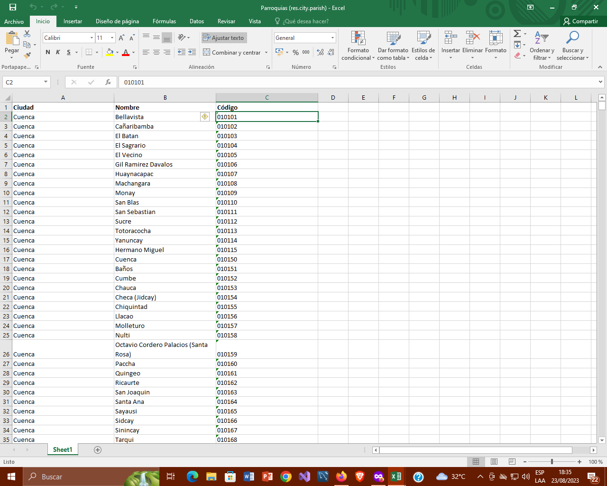
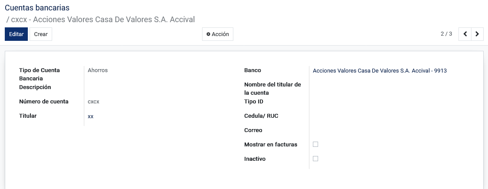
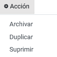
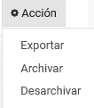

Contactos
==========

Contactos
---------

Nos dirigimos al módulo de Contactos, opción Contactos.

En contactos se puede añadir a un nuevo contacto o editarlo ,seguido de
la imagen o foto que lo identifica, seleccionar si este corresponde a
una persona o compañía, el nombre de la empresa o compañía a la que
pertenece, podemos ingresar la dirección, la provincia, la parroquia,
etc. Se puede seleccionar el tipo de identificación (cédula, Ruc,
pasaporte, placa o consumidor final), una vez que se selecciona cedula o
Ruc nos indica que debemos ingresar los números de dichos
identificadores, podemos seleccionar si la persona es natural o
jurídica, el tipo de sexo, el estado civil, el puesto de trabajo,
teléfono, móvil, el correo electrónico, el nombre del sitio web, el
título, el idioma, el tipo de cliente si es público o privado, la zona
horaria o la etiqueta, guardar.

En la parte superior se encuentra una serie de opciones que muestran:La reuniones
planificadas,oportunidades de ventas, el total de ventas realizadas, el
total facturado,el número de tickets,saldos y pagos para conciliar. Si
se desea saber más al respecto, al momento de hacer clic en una de estas
opciones el sistema lo enviará a dicha vista para su análisis
respectivo.

.. image:: ../static/images/5/contactoopciones.png

Contactos y direcciones:Podrá añadir contactos relacionados al existente
y podrá especificar si es un contacto, dirección de factura, dirección
de envió, otras direcciones y direcciones privadas.

.. image:: ../static/images/5/contactosydirecciones.png

Notas internas: Podrá generar una nota para guardar información respecto
a dicho usuario.

.. image:: ../static/images/5/notasinternas.png

Ventas y Compras: Parte fundamental de la creación de contactos, es la
que nos permite especificar datos relevantes para los procesos
contables.

.. image:: ../static/images/5/ventasycompras.png

Facturación: Permite ingresar las cuentas y asientos contables
que el contacto creado específica.

Información Adicional: Permite agregar información , cómo agregar línea, que aparece en las
facturas.

.. image:: ../static/images/5/informacionadicional.png

Configuracion
--------------
Etiquetas de Contacto
^^^^^^^^^^^^^^^^^^^^^^

Nos dirigimos al módulo de Contactos, dirigirse al menú de Configuración y buscar la opción Etiquetas de Contacto.

Esta opción nos permite generar etiquetas a los clientes, la función de
la etiqueta es la de identificar de manera rápida a un cliente por algún
tipo de atributo.

.. image:: ../static/images/5/etiquetasdecontacto.png

Las etiquetas creadas solo aparecerán en los
contactos si están marcadas como activas, caso contrario no aparecerá
dicha etiqueta y la categoría padre es una etiqueta creada anteriormente
en el sistema que derivará más etiquetas.

.. image:: ../static/images/5/configuracionetiquetasdecontacto.png

Títulos de contacto
^^^^^^^^^^^^^^^^^^^^^^
Seleccionar el módulo de Contactos, dirigirse al menú de Configuración y buscar la opción Títulos de contacto.

Esta opción nos permite la creación de títulos profesionales o
formalidades con su abreviatura para posteriores utilizaciones.

.. image:: ../static/images/5/titulosdecontacto.png

Industrias
^^^^^^^^^^^^^^^^^^^^^^

Seleccionar el módulo de **Contactos**, dirigirse al menú de
**Configuración** y buscar la opción **Industrias.**

Esta opción nos muestra cada una de las industrias actualmente
existentes.

.. image:: ../static/images/5/industrias.png

Dentro de este apartado, se encuentra el botón gráfico para exportar
todo los datos:

.. image:: ../static/images/5/industriasdescarga.png

.. image:: ../static/images/5/industriadedatos.png

Localización / Países
^^^^^^^^^^^^^^^^^^^^^^

Seleccionar el módulo de **Contactos**, dirigirse al menú de
**Configuración** y buscar en **Localización** la opción **Países.**

Nos permite la creación, edición y eliminación de los países. Por
defecto el sistema mostrará todos los países existentes actualmente, con
sus respectivos datos. Un país está conformado por 8 datos importantes
que son el nombre del país, la bandera del país, la moneda, el código
del país, en nuestro caso también estará el código ecuatoriano, código
de la llamada del país, la etiqueta del IVA, por último, pero no menos
importante sus estados o también conocidos como provincias en el caso de
Ecuador.

.. image:: ../static/images/5/localizacionespaises.png

.. image:: ../static/images/5/localizacionpaises.png

Nota: Es importante añadir los estados a los países
que más utilicen, ya que nos ayudará a identificar de manera precisa las
ubicaciones que se emplean en los módulos de **Contactos** y
**Contabilidad.**

Dentro de este apartado, se encuentra el botón gráfico para exportar
todo los datos:

.. image:: ../static/images/5/localizacionpaisesdescarga.png

Localización / Provincia
^^^^^^^^^^^^^^^^^^^^^^

Seleccionar el módulo de **Contactos**, seleccionar el menú de
**Configuración** y buscar en **Localización** la opción **Provincias.**

De igual manera que en la creación de países, se debe ingresar el nombre
de la provincia, el código de ésta, el país y las ciudades de dicha
provincia.

Nota: Es recomendable crear las ciudades en esta opción. Al momento de
ingresar a esta opción el sistema mostrará de manera descendente las
provincias según el código de provincia. Si se desea buscar las
provincias de un país específico es recomendable utilizar el filtro de
la parte superior (Para más información revisar Filtros).

Dentro de este apartado, se encuentra el botón gráfico para exportar
todo los datos:

.. image:: ../static/images/5/localizacionprovinciadescarga.png

.. image:: ../static/images/5/localizacionprovinciadatos.png

Localización / Grupo de paises
^^^^^^^^^^^^^^^^^^^^^^

Seleccionar el módulo de **Contactos**, dirigirse al menú de
**Configuración** y buscar en **Localización** la opción **Grupo de
países**.

Nos permite agrupar países para la formación de “continentes” en el
sistema e inclusive añadir alguna tarifa pre creada en el sistema.

.. image:: ../static/images/5/localizaciongrupodepaises.png

.. image:: ../static/images/5/localizaciongruposdepaises.png

También permite realizar dos acciones tales como:

**Duplicar:** Clona el registro

**Suprimir:** Elimina el registro

.. image:: ../static/images/5/gruposdepaisesaccion.png

Dentro de este apartado, se encuentra el botón gráfico para exportar
todo los datos:

.. image:: ../static/images/5/gruposdepaisesdescarga.png

.. image:: ../static/images/5/gruposdepaisesdatos.png

Localización / Ciudades
^^^^^^^^^^^^^^^^^^^^^^

Seleccionar el módulo de **Contactos**, dirigirse al menú de
**Configuración** y buscar en **Localización** la opción **Ciudades**.

Al igual que países y provincias, podremos crear, editar y eliminar las
ciudades en esta opción del sistema.

.. image:: ../static/images/5/localizacionciudades.png

.. image:: ../static/images/5/localizacionciudadesdelsistema.png

También permite realizar dos acciones tales como:

**Duplicar:** Clona el registro

**Suprimir:** Elimina el registro

.. image:: ../static/images/5/localizacionciudadesaccion.png

Dentro de este apartado, se encuentra el botón gráfico para exportar
todo los datos:

.. image:: ../static/images/5/localizacionciudadesdescarga.png

.. image:: ../static/images/5/localizacionciudadesdatos.png

Localización / Parroquias
^^^^^^^^^^^^^^^^^^^^^^

Seleccionar el módulo de **Contactos**, dirigirse al menú de
**Configuración** y buscar en **Localización** la opción **Parroquias.**

Es una subclasificación de las ciudades, sirven para complementar datos
referentes a la ubicación, en este caso el sistema cuenta con todas las
parroquias de las ciudades del Ecuador.

.. image:: ../static/images/5/localizacionparroquias.png

Dentro de este apartado, se encuentra el botón gráfico para exportar
todo los datos:

Cuentas Bancarias / Bancos
^^^^^^^^^^^^^^^^^^^^^^

Seleccionar el módulo de **Contactos**, seleccionar el menú de
**Configuración** y buscar en **Cuentas Bancarias** la opción
**Bancos**.

Esta opción permite crear, editar y eliminar Bancos en el sistema, estos
bancos son de vital importancia crearlos ya que están estrictamente
relacionados a nuestra contabilidad. Al momento de crear un banco, los
datos más relevantes son el nombre del banco y el código de
identificación bancaria (BIC/SWIFT).

.. image:: ../static/images/5/cuentasbancarias.png

Al igual que en anteriores apartados, se le permite al usuario descargar
un archivo excel de estos datos ingresados:

.. image:: ../static/images/5/cuentasbancariasdescarga.png

.. image:: ../static/images/5/cuentasbancariasdatos.png

Cuentas Bancarias / Cuentas Bancarias
^^^^^^^^^^^^^^^^^^^^^^

Seleccionar el módulo de **Contactos**, dirigirse al menú de
**Configuración** y buscar en **Cuentas Bancarias** la opción **Cuentas
Bancarias.** Esta opción permite la creación, edición y eliminación de
cuentas bancarias, al momento de crearla se deberá colocar el tipo de
cuenta (Ahorros, Corriente o Virtual), el número de cuenta, el titular,
el banco, el nombre del titular o contacto, correo y nos da a elegir si
se mostrará en facturas o no.

.. image:: ../static/images/5/vistacuentasbancarias.png

También el usuario podrá archivar, duplicar o suprimir el registro:

De igual manera, el sistema permite la descarga de un archivo xlsx
(excel) para la visualización de los registros:

.. image:: ../static/images/5/cuentasbancariasdescarga.png

.. image:: ../static/images/5/cuentasbancariasdescarga.png

Tipo de Identificación
^^^^^^^^^^^^^^^^^^^^^^

Seleccionar el módulo de **Contactos**, dirigirse al menú de
**Configuración** y buscar en **Cuentas Bancarias** la opción **Tipo de
Identificación.** Esta opción permite visualizar los formatos de
documentos, con opciones a archivarlos, exportarlos, desarchivarlos,
marcar la casilla para cambiar el estado a activo e inactivos.

.. image:: ../static/images/5/vistatipodedocumentacion.png

Permite exportar los documentos,archivarlos y desarchivarlos:

.. image:: ../static/images/5/exportartiposdedocumentacion.png

.. image:: ../static/images/5/exceltipodedocumentacion.png